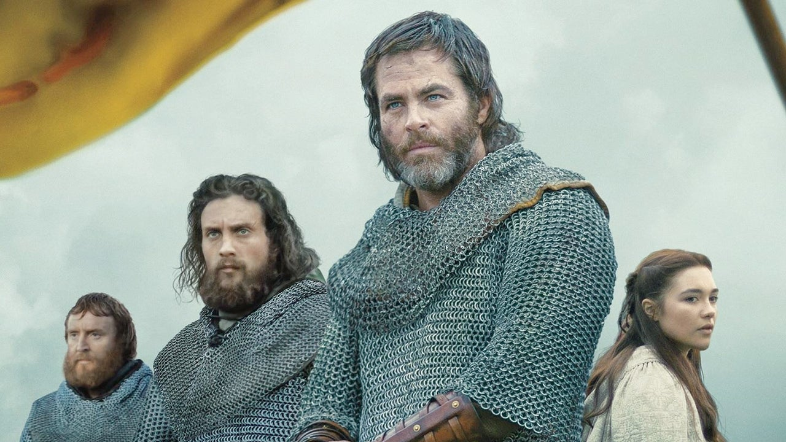
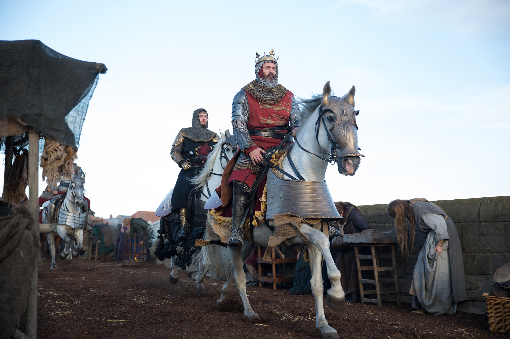

**Robin John Mahr** 5 May 2020

Netflix’s _Outlaw King_ and _The King_ are two feasts for lovers of medieval history, intrigue and battle. They have big budgets, armies of extras, and realistic and impressive fighting. We are truly blessed to witness this new Golden Age of television.

In _Outlaw King_, Robert the Bruce (Chris Pine) rebels for an independent Scotland against English rule imposed by King Edward I (Stephen Dillane). The plot, robust and engaging, sticks closely to the history and spiritually is a sequel to the tale of _Braveheart_ both historically and cinematically.

The filming is gritty, realistic and believable. In battles, armour becomes spattered with mud and flecked with, usually, enemies’ blood. Nobody emerges from these life or death fights the same as they went into them.

Some of the historical attention to detail is really worth mentioning. My favourite is the use of proper arms and armour. Refreshingly there are no kilts. These were only widespread in the 1600s, _Braveheart_ take note. When mail coifs are worn, the chainmail hoodies used in battle, they also have padded accompaniment underneath (it stops the chafing you see). Perhaps best, the men at arms, the non-knights, use spears not swords. In the middle ages death came mostly at the end of sticks, be those spears or pole axes. The ubiquitous sword is a modern fantasy.

The film gets across how the Scottish were able to put up a fight against the more powerful English: by using their mobility. The Scots went from one immobile English occupied castle to another burning them down. Edward I shows this contrast another way. He had three months spent building a comically large trebuchet, a giant siege engine that threw rocks, called “Warwolf”. To no effect. At all. And Edward was desperate to fire his new toy.

Now to _The King_, we jump ahead a hundred years to meet Henry V (Timothée Chalameet).

Here the young English king Henry V takes slight at the French. So with a few men on a few boats he sailed across the sea to conquer France.

It was a blast of adventure, and bonkers. And the film often gives a real sense of this.

The king led an army mainly of English longbowmen – commoners armed with what are essentially sticks – to take on the might of the French nobility in their own lands who themselves fought sealed in armour atop thundering horses. At Agincourt.

The plot and viewpoint owe a great deal to Shakespeare’s play _Henry V –_ although Shakespeare himself borrowed from monarchy flattering Elizabethan history books. The Shakespeare link also lets the film use language that is lavishly poetic and often dripping with a sense of history making decisions. It proves again how a redux on Shakespeare can be fun and engaging.

We also get the entirely fictional English yeoman stalwart Jon Falstaff (Joel Edgerton), one of Shakespeare’s most beloved characters. At times in the film Falstaff becomes an observer for the ages for us, seeing through history and forward to consequences. This gives him many of the best lines, such as his observation that “nothing stains the soul so indelibly as killing”. The portrayal of quite a statesman-like Falstaff lets the film have a freer Henry V often marked with youthful recklessness.

While beautiful written and mostly well-acted, a few French accents leave something to be desired. And so too there are some historical accuracies that rub a little. Like Henry V’s always-on chainmail hoodie without chafe-preventing-undergarment, for example. And, hey Henry, when you’re fighting, don’t you know? Helmets save lives!

But, as we are dealing with a film about Agincourt, the unavoidable historical controversy is how exactly the English longbowmen fought: did they pick their targets or did they shoot up into the air and hope? And did the film accurately portray this?

Dear reader, I’ve looked into the still-raging debate for you. But the jury is still out. Indeed the discussion reminds me of that of _Monty Python’s Quest for the Holy Grail_ on coconuts and the air speed velocity of a swallow. \[Ed – if you don’t understand this reference then watch that film too – it’s brilliantly silly\].

<iframe src="https://giphy.com/embed/5tiIlnk9rPNUYWXDwl" allowfullscreen width="480" height="270"></iframe>

So don’t let that confuse us too much. After all we know who won.

So then which film is best?

Both films are superb in their own way and neither will disappoint.

You decide.

Watch **Outlaw King** [here](https://www.netflix.com/watch/80190859?trackId=13752289&tctx=0%2C0%2C5fa1652a-0c2d-43c2-8bdb-1de9b455459c-2409813%2C%2C) and **The King** [here](https://www.netflix.com/watch/80182016?trackId=13752289&tctx=0%2C0%2C77c2ffe6-dc49-476a-805b-6a5c8f4af935-212247953%2C%2C)
