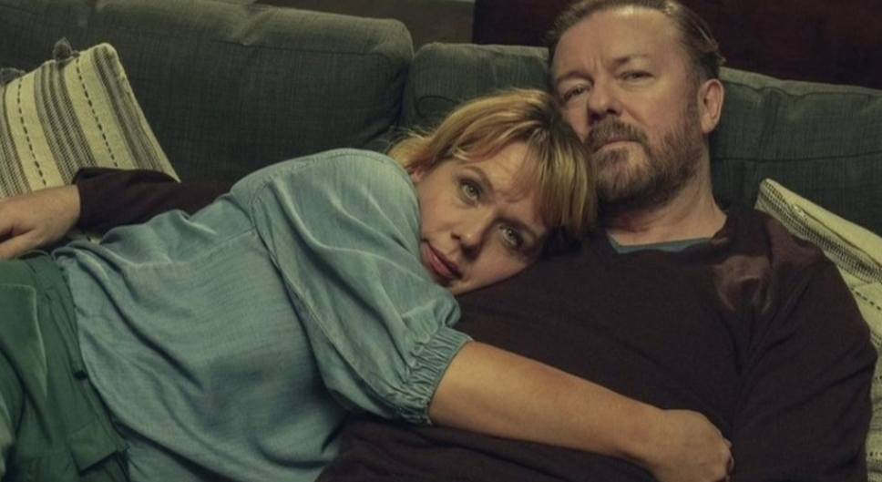
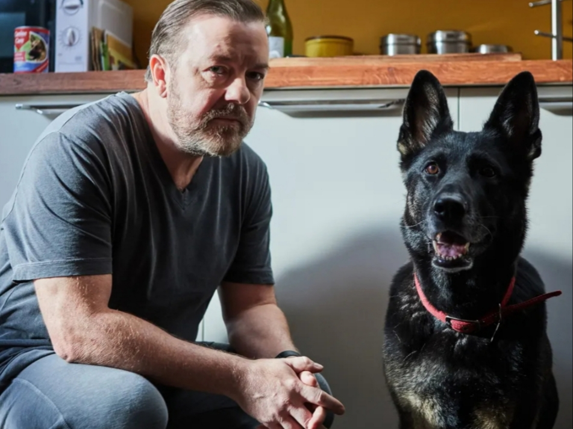

You may know Ricky Gervais for his brutally honest putdowns of the Hollywood and TV elite when hosting awards ceremonies or perhaps for his opinionated social media postings.

In these Gervais divides opinion. For his huge and voluble fan base he’s a staunch truth merchant cutting through hypocrisy and sanctimony. For others, he’s crass loudmouth in love with the sound of his own opinion.

But at odds with these two extroverts, the same Gervais is also the writer and star of the widely acclaimed Netflix drama series _After Life_ whose second season has just landed.

And so what may surprise you is just how subtle and sometimes gentle is this deceptively simple tale of loss and of navigating a future suddenly without the one you loved.

_After Life_ – two words not the one-word “afterlife” – is set in a parochial English town, fictional but entirely recognisable for its homespun rhythms and customs where Gervais plays Tony, a local newspaper reporter.

We first encounter Tony as an embittered cynical miserabilist, railing and complaining against anyone and anything. But this is not the cynicism of the “hack” journalist.

We find out that Tony has recently lost his wife Lisa to cancer and as a result he just cannot see the point in carrying on his life after her death. He cannot see meaning in a world that so randomly removed her.

Over his shoulder we see the home videos Tony mournfully watches on his laptop where he and Lisa were blissfully happy. We see too video messages Lisa sent him from the grave in anticipation of her death.

The banality of Tony’s life, the sheer tedium of just marking time for no apparent reason is the key plot device of the show. It’s not really a sitcom, more a reflection on the nature of existence with some good gags about small-town office politics and ludicrously boring stories in the town’s weekly free sheet the _Tambury Gazette_ on which Tony works.

"Out-of-date Scotch egg sold to teen"  
_Tambury Gazette_

The understatement of _After Life_ is not, however, new to Gervais. It was also at the centre of his previous successes of _The Office_ and _Extras_. These too offered observations about frustrated lives mixed with the easier laughs at terrible bosses and ego-maniacal actor types.

_After Life_ is more sombre and philosophical than these previous efforts but it still follows in a tradition of wry observation about human nature that the UK's best sitcoms have mastered.

A classic example, particularly pertinent in these times of lockdown, is _Porridge_. This conveyed the desperate waste of lives endured by prisoners but without over-ladling the bleakness.

Of course _After Life_ isn’t nearly as funny as _Porridge_ – nothing is. Both the writing and acting in _After Life_ are very funny, but they offer few belly laughs.

But it is a thoughtful, carefully constructed little drama that makes you think about the nature of big and important themes - love, life, death, and how to face tomorrow when today has been so relentlessly lonely.

“We’re all struggling” says Tony at one point, rediscovering empathy for others as he makes small steps towards some kind of recovery. We accompany him on his journey through the stages of grief, and it makes for often mournful viewing, but it’s uplifting in its own small yet important ways.

Tony’s interplay with other characters– his socialisation – pushes him slowly forward to reconciliation with life. There’s the faithfully supportive brother-in-law who is also Tony’s editor. There’s the overweight photographer whose simplistic happy-go-lucky attitude provokes Tony’s bitter sarcasm but also some wry jealousy. And there’s an aspiring young trainee reporter whose faith in the value of journalism tests Tony’s world-weary contempt.

Many other characters pop-up to regularly test and make Tony think anew about his “after life”. Gervais is supported by a typically well-chosen cast that turns his writing into great television. Rosin Conarty as sex worker Roxy stands out. So does Penelope Wilton’s widow who shares Tony’ grief at the graveside, as they mourn their partners and try to make some sense of the world and their new and unwanted place in it.

The answers are not easy and the sadness never really dissipates, but this is arguably Gervais’s most accomplished work yet. It hits home harder than any well-deserved barb at Hollywood’s tedious vanities.

**Available on:** Netflix

**Genre:** Drama

**Running Time:** Approx. 30 minutes an episode, 2 seasons

**Makes you feel:** like there's light at the end of the tunnel

