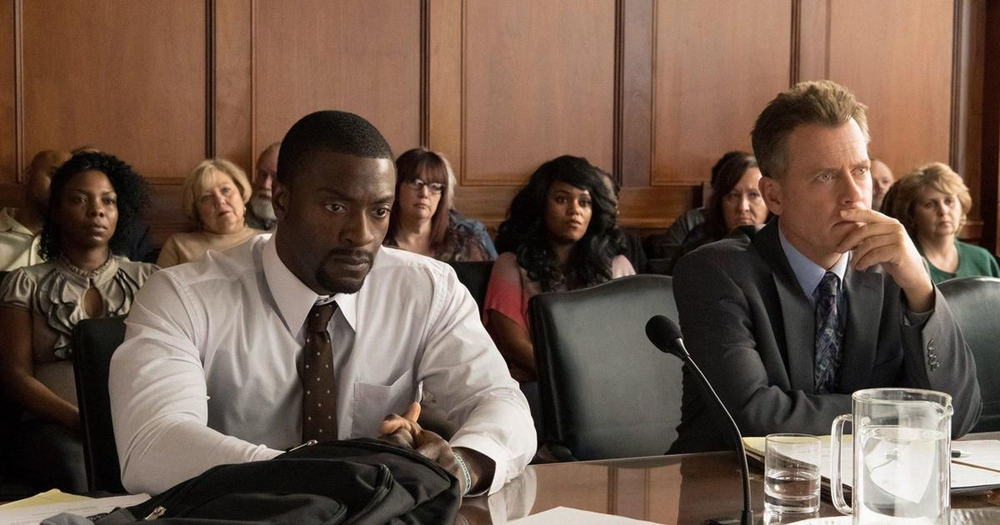

**Lulu zen-Aloush** 29 April 2020

If you enjoy films based on true stories that tell you why and how something surreal happened, then I suggest you sit back and enjoy _Brian Banks_.

In 2002, Banks was wrongfully accused of rape by classmate Wanetta Gibson, his girlfriend at the time. He spent around six years in prison and another five on parole. The case was reopened in 2012 after his accuser confessed she had fabricated the entire story. The accusation was made after the couple "made out" at Long Beach, California's Polytechnic High School, but there was never sexual intercourse between the two. Wanetta and her mother sued the school over security and they received a staggering $1.5 million.

The film is touching and ever so sad to the point that you want justice for this young man who had his life stripped away aged just 17. Despite going to hell and back, Brian Banks, played by Aldis Hodge, is portrayed as a character of love and forgiveness. As the film progresses, we grow increasingly in love with his character.

He leaves prison a stronger, wiser and more mature man. The film jumps back and forth showing us the past and present, which helps us relive Brian's worst and best moments. We follow his journey as he comes out of prison eager to clear his name.

Banks used to be an American football player before he was falsely accused and prisoned. His main goal was to return back to his dream of becoming an NFL player — which the real life Brian Banks makes happen.

_you will have tears of sadness while watching this film_

We see that prison life was very hard for Brian to cope with as he struggles day by day. It’s heart-breaking to watch, especially when we know the young boy is innocent. The film makes you feel angry, upset and disappointed at Wanetta and her mother for the false accusations, but mainly the system that led Banks down. Yet, we are hopeful that his life may be brighter once he’s out.

I assure you that you'll have tears of sadness while watching this film, particularly when we see Banks being dragged away from his mother by officers. You'll feel sympathy towards the mother as she loses her only child.

Initially, it is unclear why girlfriend, Kennisha Rice (Xosha Roquemore) — who is the fictional version of Wanetta Gibson, lied about the whole accusation. We never get an exact answer, but parts of the explanation becomes clearer through the film. However, we do start seeing a side to Rice that we didn’t at the start. She was clearly pressured by her mother, and the negative influence plays a big part in who she is. In a scene Rice even clarifies that Banks never raped her. But why _did_ she make the rape accusation? Perhaps she felt rejected? Unwanted? We are only really left with our own assumptions. You’ll either end up hating her or you may sympathise with a girl who clearly was immature at the time.

And...Hallelujah… we finally have a team of people from the Californian innocence project who are determined to clear Banks's name. It’s a relief that after so long we finally come across Justin Brooks (Greg Kinnear), a criminal defence attorney, who is willing to help Banks.

The tension is high as people are rallying around to investigate the day that Rice had accused Banks of rape. Confusion comes in as DNA proof was never found to show that Banks was guilty, nor did the investigator search the apparent place of the incident.

The system unforgivably let Banks down, which lost him years of the prime of his life. Thankfully, Brooks pushes the system to reopen his case, which gives Brian the opportunity to tell his side of the story.

Without spoiling the entire film, I suggest watching this as the script has successfully played out the true story of Brian Banks. Despite the tragedy, this is an inspiring story of a man who will do anything to pursue his freedom, with a set of people fighting for justice.

**Genre:** True life drama

**Makes you feel:** Angry, redeemed, life affirmed

**Running Time:** 99 Minutes

<figure>

<figcaption>

Now watch it!

</figcaption>

</figure>
