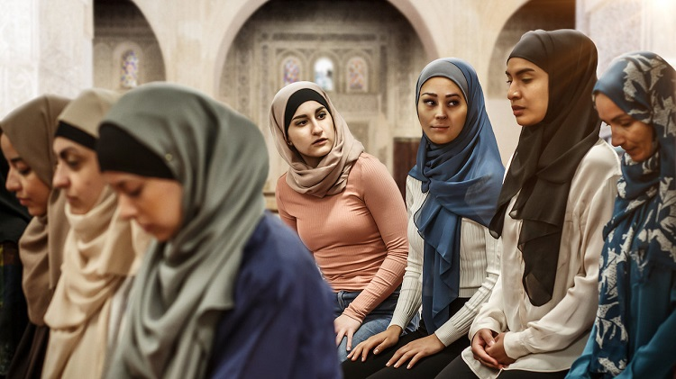

The _Caliphate_ (2020-present) is a thriller drama series that will give you gut-punches of shock and claustrophic fear for those under the thumb of the caliphate in Raqqa, Syria.

The drama closely follows the lives of young girls in Sweden being manipulated into becoming jihadi brides for terror groups in Syria. These women become convinced that life in Raqqa under the capiphate is paradise - until they experience it for themselves.

_Caliphate_ gets across that these are innocents preyed upon and raises the question of what can be done?

The first episode focuses on the life of Swedish Pervin, played by Gizem Erdogan, and husband Husam, played by Amed Bozan, and the struggles they face living in Syria. Pervin is desperate to leave Raqqa so that she can return back to life in Sweden with her newborn. Meanwhile Husam reluctantly helps to promote terrorist acts.

Pervin contacts Dolores, an anti-radicalisation advocate in Sweden and is connected to Fatima, an agent of the Swedish security services. Fatima will help but must have something in return. She orders Pervin to get information about a planned terrorist attack in Sweden. That will force Pervin to betray her own husband, and those around her. Regardless, Pervin is willing to risk it for the safety of herself and her child and won't let anyone get in her way.

Can Pervin get out of this terrible nightmare or will her dreams of returning back to Sweden be over quicker than we think?

This drama makes you ask, continuously, can these young women be saved?

It also makes the you think anew about _why_ and _how_ these young girls flee to Syria, and how hard it can be escape the nightmare.

**Available on:** Netflix

**Genre:** Thriller Drama

**Running Time:** Approx. 46 minutes an episode, 8 episodes
