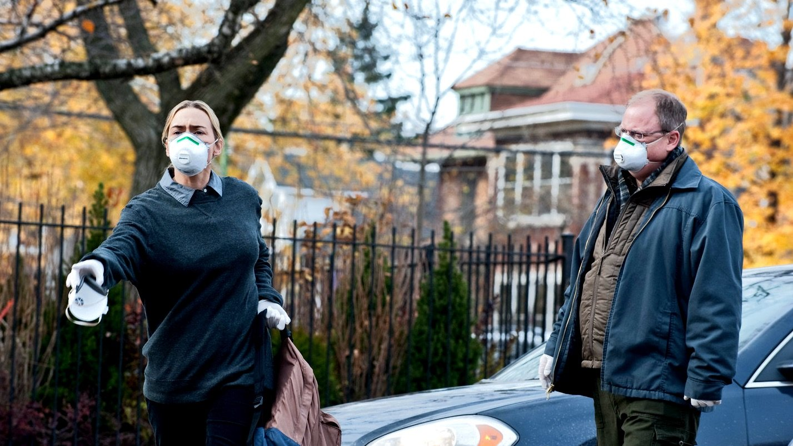

**Zuleica Rodriguez** 11 May 2020

Trying to make sense of living in Covid-19 lockdown?

Then consider watching _Contagion_ (2011), a movie about a viral pandemic outbreak which Netflix astutely added to its catalogue shortly after the current coronavirus outbreak.

And this is not simply Hollywood fantasy, Scott Burns wrote the screenplay after getting in touch with scientists and epidemiologists to create an accurate picture of a real pandemic.

_Contagion_ has an all-star cast including [Kate Winslet](https://www.refinery29.com/en-us/2018/01/189286/kate-winslet-woody-allen-harvey-weinstein-statement), Jude Law, Laurence Fishburne, Matt Damon, Jennifer Ehle, Marion Cotillard and [Gwyneth Paltrow](https://www.refinery29.com/en-us/2020/01/9181806/goop-cruise-gwyneth-paltrow-wellness-retreat). They play variously epidemiologists, scientists and “everyday” working people who fight against a killer virus that could eradicate the human race.

The film kicks off in Hong Kong, where Beth (Gwyneth Paltrow) contracts a deadly virus called MEV-1 during a business trip. MEV-1 presents itself with symptoms similar to the flu and kills Beth a few days after she contracts it. The virus starts spreading worldwide, which kills and infects thousands at speeding rates.

Many scenes are about the contagion. Beth, the first infected person, hugs a woman who is sitting next to her at a casino bar, hands her credit card to a cashier, then to a waiter. Each is infected. Each will pass it on. Many will die.

Once epidemiologists study the virus and how it spreads, they advise social distancing and constant hand washing.

Does that ring a bell? The similarities of fictional MEV-1 with Covid-19 are apparent and scarily similar, including the symptoms: cough, fever and breathing problems.

Watching this film while living through a pandemic, may scare some even more. Or maybe they'll be reassured COVID-19 is not so bad. Either way it certainly makes the cases for being more cautious and following rules that will save lives.

In the film, military trucks carry corpses to be buried in mass graves, hospitals are saturated and epidemiologist Erin Mears (Kate Winslet) has to decide whether to use large public buildings to house the infected. The World Health Organisation (WHO) declares MEV-1 a pandemic where the sick must be quarantined, possible cases isolated and travel curtailed. The virus soon results in panic buying, then looting.

Jude Law plays vexed blogger Alan Krumwiede, who is convinced that the pharmaceutical industry and the CDC (Centres for Disease, Control and Prevention) created the virus for monetary gains.

Let's face it everyone should have taken _Contagion_ more seriously when it came out. We were complacent - at a government level and even at an individual with hand-washing and covering your mouth when coughing.

Anyway, it is common for films featuring pandemics to show actors panicking, fighting or in some sort of trauma bonding romance. But in this film, the main focus is on the work of public health officials; who learn the origin of the virus and how it evolves to try to devise a vaccine.

This is a great film to watch and let's hope we will our non-fictional battle sooner rather than later.

**Genre:** Thriller, Action, Drama

**Running Time:** 106 minutes

**Available on:** Netflix

By **Zuleica Rodriguez**
