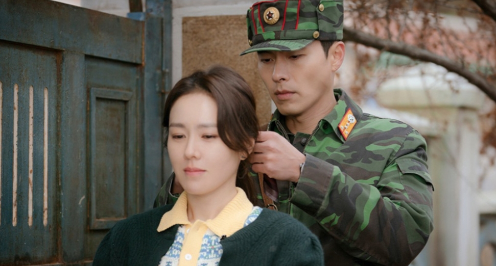

**Kat Badoova** 15 May 2020

_Crash Landing On You_ (2019-2020) is a Korean drama that will make you feel every possible emotion there is. It's a drama filled with romance, comedy, action, drama and devastation. It also explores the reality of North and South Korea, leaving you shocked at how different the two countries are.

You will need a couple of essentials while watching this show: a box of tissue, snacks, a blanket to stay warm and cosy and plenty of time because you will not leave your TV until you finish all 16 episodes!

When Yoon Se-Ri (Son Ye-Jin), a South Korean Chaebol heiress (Chaebols are the family conglomerages like Samsung that dominate economic life in South Korea), gets swept away by a tornado while she was paragliding, her whole world crashes. She finds herself in North Korea, stuck in a tree with no idea on what to do. She meets Captain Ri Jeong-Hyeok (Hyun Bin), who immediately suspects she's South Korean spy. (This is not so uncommon as you might think!)

After a series of unfortunate events, including a land mine and troop patrols, Se-Ri and Jeong-Hyeok decide to work together. From then on Jeon-Hyeok and his four comrades help out Se-Ri and constantly try to find ways to get her back to South Korea without getting caught.

What’s most interesting about this show is the clear distinction between South Korea and North Korea. Although they are part of the same nation, their differences are made evident in the show.

Se-Ri begins to unravel the unconventional way North Koreans live. She has to deal, for example, with constant power outages and the lack of running hot water. As someone who comes from a rich background, Se-Ri is shocked when she cannot get a hold of any essentials like shampoo, conditioner or even a cleansing oil. North Koreans use bars of soap, but for someone like Se-Ri this is a shock. The only way to get these products is by purchasing them illegally - and they are essentials after all!

The series shows how contacting other countries from the North is out of the question - here, for example, there is no internet for most citizens. For phone apps, for example, you must visit an _actual_ store and get someone to install it for you. Outside the capital, Pyongyang, this is a particular challenge. The North speak in a different satoori, dialect or accent, than the South. Also absent: basics products like rice cookers, vacuums and lamps.

It is quite fascinating to find out facts about North Korea

Of course when the new gang eventually reach the south they are astonished by the modernity - and we get to watch them. Ripped jeans are a particular source of bedazzlement. The internet and the computer games pull them in as they do us. Every technological gadget is novel - and going with them on this discovery is both funny and provoking. And Seoul’s night skyline marks theie transition to a new world.

I definitely recommend this show to those that are suckers for a romance with a pinch of action, drama and comedy!

**Available on:** Netflix

**Genre:** Korean-Drama

**Makes you feel:** emotional, addicted and lucky to have the freedom and technology your country has.

**Running Time:** Approx. 1 hour and 20 minutes an episode, 16 episodes
