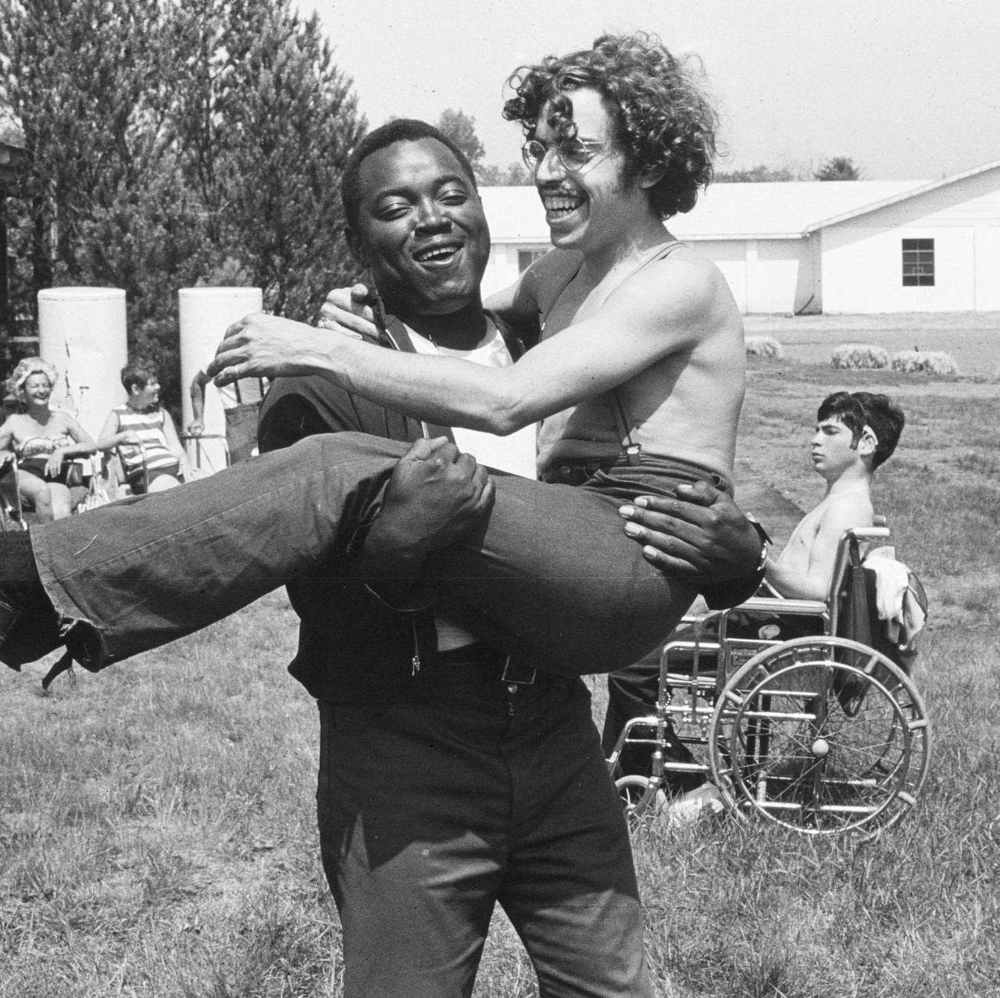
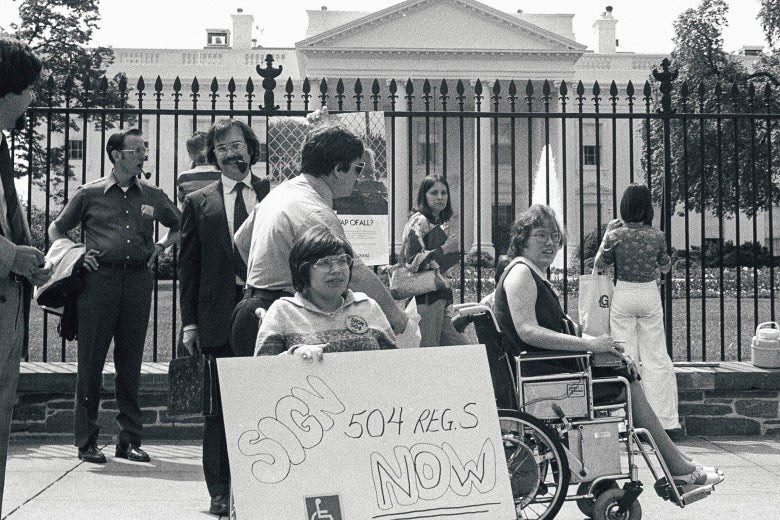

**Michelle Harris** 12 May 2020

You really don’t want to miss this documentary.

It shows how a few people, infused with the spirit of the 1970s and often severely disabled, took on the US government and won rights that will echo down the ages.

It will make you laugh, cry and well-up with emotion. It will challenge how you understand the civil rights movement and what and how young people can be. It will show you the best in humanity.

And it all started in a hippy summer camp.

Press play and the documentary opens with a well-known protest song of the 70’s, the Buffalo Springfield classic, ‘For what it’s worth.’ “There’s something happening here.”

Stop for a second or two to play the tune if you don’t know it.

https://www.youtube.com/watch?v=80\_39eAx3z8

This was a highly politically charged time. We all know about the Vietnam war protests and the civil rights movements for racial, gender and sexual equality.

But there was another fight set to emerge, for disabled rights. This was against the “architectural discrimination” that had buildings with built-in barriers for disabled people and attitudinal discrimination that packed those disabled off to institutions or special-ed classes.

It all begins with a summer camp called Jened in 1971. Jened was a hippy experiment to make a camp that allowed disabled teenagers a chance to be just that, teens.

Infused by this experience of possibility, this small camp and the campers it in become the seeds of a bigger movement that would push for a fairer, more accessible America. And as the USA changed other nations and campaigners took notice.

Black and white archival footage including and by Jim Le’Brecht – one of the campers and now co-director of this film - for ‘just a laugh’ offers us a privileged firsthand insight into the summer that would go on to change legislation 20 years on.

Le’Brecht captures truly authentic unfiltered interviews. The interviews are beautifully woven throughout, documenting a mix of humorous, yet momentous accounts that are truly insightful to the lived experience and desires of disabled people.

Sexuality and privacy rights were common themes in the interviews. One young lady with speech difficulties due to Polio had struggled to be heard and understood, yet despite this she made the most profound point in camp and out: as disabled people they had been denied the right to be alone. Another camper expanded on her point, explaining to the camera shockingly just how many campers had been denied the right to privacy.

But the filming strikes tunes not just for the disabled. It also cranks out a sort of nostalgia in you for a freeness we all find difficult to attain in the twenty first century.

The camp had precious little health and safety despite the greater risks its disabled patrons faced. The well-loved camp director even jokes that he was digging holes because the campers were clumsy and it was funny to see them fall over. The camp workers were often indistinguishable from the campers. We see hugs, dancing, shouting, stolen kisses and an outbreak of crabs.

Compellingly for a modern viewer the campers, although young, have a profound sense of agency. There were a number of true characters, but perhaps the person who most stood out was Judy Heumann, who would go on to lead the Disabled In-Action group (D.I.A.) and to organise the shock troops for a disability revolution.

It was leaving the camp after a couple of short weeks that perhaps was most galvanising. There was a shared sense of dread to return to a world that inhibited their independence and so this became the catalyst for a wave of political change that spanned over two decades.

Section 504 was an add on to civil rights legislation for disabled rights but it was limited, unfunded and unpoliced. Implementing it became the focus of demonstrations and rallies to challenge institutionalisation and inaccessibility.

The showdown came in a 23-day occupation/siege in San Francisco. This film documents unmissable first hand footage of the largest and longest demonstration held by disabled people and which led to immediate victories and eventually to the Americans with Disabilities Act (ADA) of 1990. 

A few key people and groups understood what was at issue and supported the demonstrators including unions, the mayor and a handful in the media. Strikingly the protesters gained support from the Black Panthers, a radical civil rights group, that provided free meals for the occupation and understood their individual fights were not that different, and sadly not yet over.

This documentary focuses our lens on a poignant part of history that risks being lost or, worse still, repeated if we don’t demand our rights and insist on our humanity.

Watching it makes you wonder why we didn’t know of its historical significance before, and why it has no place in our curriculum.

_Crip Camp_ is a sweetly affirming, bracingly irreverent, joyous chronicle of triumph and adversity. It is a sobering reminder that it takes a collective unwavering effort to make a meaningful difference in this world.

This strikes home in the current pandemic when so many disabled people feel invisible after our needs were not acknowledged in the UK government’s shockingly narrow vulnerable category list.

Meanwhile, back in the USA, people with disabilities say rationing care policies are violating their civil rights after disabled people were denied medical treatment for coronavirus. There is still much to be done. 

‘For what it’s worth,’ _Crip Camp_ reaches way beyond its choir, beyond those who have long been an underrepresented minority. This documentary is an invitation and provocation to all, to celebrate our shared humanity and continuing the fight for our rights.

**Recommend _Crip Camp_** **to friends & family by sharing this article**

**Genre:** Documentary

**Makes you feel:**

like freedom is possible

**Running Time:** 1 hour 40 minutes

<figure>

<figcaption>

Now watch it!

</figcaption>

</figure>
