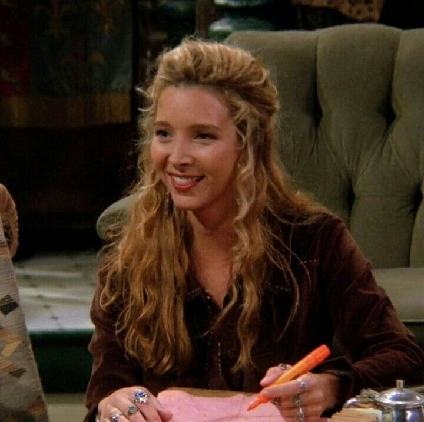

I was one of those people who had never watched _Friends_. Until my sister convinced me.

So let me do you a favour and push you a little because I really didn't think I would end up loving it and watching it as much as I do.

_Friends_, if you don't know, is a sitcom that ran from 1994 to 2004 - so yeah old. But it has regained entire new generations of viewers on Netflix.

It's based on six friends in their twenties living in New York who have left home but not settled down in couples yet. We follow the group of friends as they stick together through thick and thin and through numerous relationships.

So, let me introduce you to these incredibly funny people who could be _your_ friends too.

**Joey Tribbiani** 

Joey (Matt LeBlanc) is a struggling 25-year-old American-Italian actor. He is childlike, something of a womaniser, and has a heart of gold. He is considerate towards his friends, which we see a lot of in the show, as he constantly chooses his friends over women. In an interview with _Today_ magazine, LeBlanc, who plays Joey, said: "Joey isn’t dumb, he’s just incorrect." Well, I'm not sure if Joey was either of the two, but regardless, it worked for him for ten whole seasons. How does Joey attract all these women? It must be his chat-up line: "How _you_ doin?"

**Phoebe Buffay**

Phoebe (Lisa Kudrow) is the weirdo of the group. The rest if the gang show their surprise at what she does, but dont criticise her for her strangeness. Instead they tend to welcome her alternative take on life.

Her list of eccentrcity is long but includes changing her name to Banana Hammock and producing the hit song _Smelly Cat,_ first performed at their local cafe "Central Perk".

Phoebe lives a hard life and often struggles, but she fiercely independent and can be a real fighter in support of her friends. And so she always seems to find happy endings that contribute to the show's positive vibe.

**Chandler Bing** **& Monica Geller**

Look this isn't really a spoiler. The romance between Chandler and Monica takes quite a long time to be established but you can see it coming a mile off.

Chandler (Mathew Perry) is Mr Sarcasm. He's the laid back cheeky one-liner king - even if he's wracked by insecurity. Monica meanwhile is an OCD neat freak who is kind and in many ways the most driven of the lot. Her back-stop though will explain she too has her own insecurities.

So I guess near opposites do attract, right? This hot duo will take you through sorrow and joy. They are _the_ perfect addition to this little group of friends.

**Ross Geller & Rachel Green**

A second relationship that ran through the ten seasons of friends is between Ross (David Schwimmer) and Rachel (Jennifer Aniston). Again the will they wont they - you know they will, eventually - lasts years!

Ross is the a geek who's into dinosaurs guy, and Rachel is a rich kid from Long Island who has been cut-off from the family money.

You will see Rachel gain her independence and grow into an intelligent young woman as the show progresses. Ross and Rachel's complicated relationship definitely adds to the show and the couple didn't always see eye to eye.

The show was the biggest thing on TV for years and so had guest appearances from stars such as Reese Witherspoon, Tom Selleck, Brad Pitt and many others.

_Friends_ won’t fail to make you laugh and if you end up watching it, and love it as much as I do, then I recommend you keep watching the bloopers or even wait for their special reunion.
