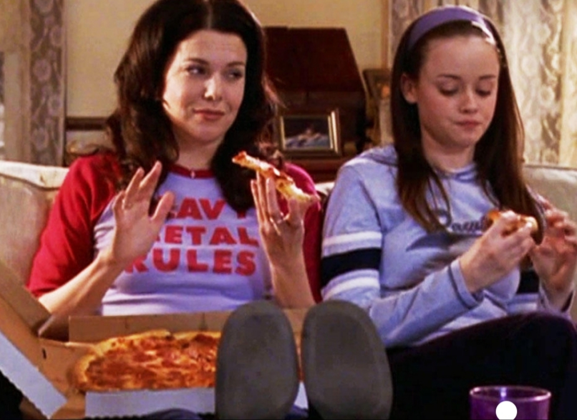

If I had to choose one word to describe this show, it would be iconic; the problem is that one word is definitely not enough!

I have such great memories of it. When I was little, it was on TV in the morning and, if I was lucky enough to wake up early, my mum would let me watch it with her.

The show tells the story of Lorelai, 32, and her daughter Rory, 16. Yes, you have done the maths correctly, she had her child when she was sixteen. They live in Stars Hollow, an eccentric town in Connecticut, USA. It intertwines with the stories of the people who live in the town, their families and friends.

Amy Sherman Palladino, creater of the show, made a lovely environment where the neighbours are outlandish but have loving stories and charming personalities, winning a special place in fans' hearts.

_I predict this will win a place in your heart_

Stars Hollow is an idyllic town where every season of the year is accompanied by parties, festivals or fairs. Every morning at "Luke’s", people have pancakes or eat burgers accompanied by a high doses of caffeine, because as Lorelai likes to say “Everything in life has something to do with coffee. I believe in a former life I was coffee”.

The location and characters are combined with fresh, witty, high-quality dialogue. The series also offers plenty of cinematographic and literature references and big slices of pizza. That makes every episode fly by!

As the seasons on the TV go by you will see the evolution of their lives. Rory starts about to attend a private school and it ends from college. So there’s plenty of room for love, heartbreaks and laughs along the way.

And there are, of course, love stories, which are tender, heart-warming and simple like any we could wish for. Are you Team Dean, Jess or Logan? Because I’m definitely team Logan!

But these are not the core of the show. The most important story line is the exploration of the mother/daughter relationship. It’s amazing how the director manages to shift their personalities, over time making the daughter much more mature and responsible than her mother.  

Their relationship with Rory's grandparents is also quite interesting. They represent everything that Lorelai despises. Although she ran away after giving birth, they become her lifeboat when she really needs help. I would dare to say that the title of the show also includes Emily Gilmore, the grandmother. Lorelai's relationship with her parents is definitely the funniest of the show!  

Grandpa Richard: I was making a long-distance call  
Lorelai: God?  
Richard: London  
Lorelai: God lives in London?  
Richard: My mother lives in London  
Lorelai: So, God is a woman. I knew it. And she’s also a relative. Now it’s gonna be so much easier to get Madonna concert tickets.  

This is definitely not an “only girls show” as it has been called multiple times. Just because the main characters are females it doesn’t mean that the topics they explore in the show are “girly”. The show is based around humour, but in a different way than other shows like _Friends_ for example. The director runs away from forced laughs from an audience and he focuses on amazingly sarcastic dialogue.  

All in all, this is an easy and dynamic show to watch during quarantine if you want to laugh and not worry about anything. And as the theme song says “Where you lead, I will follow…” - this show, I believe, is going to have a special place in your heart, and if you don’t believe what I say, take me as an example! Rory was the first person to inspire me to pursue a journalistic career. And here I am, four years later, about to graduate in journalism! I recommend you this show that changed my life and made me realise that I can smell snow!

**Genre:** Drama/Comedy

**Makes you feel:**

like you can lose your worries

**Running Time:** 40 minutes an episode

<figure>

<figcaption>

Now watch it!

</figcaption>

</figure>
