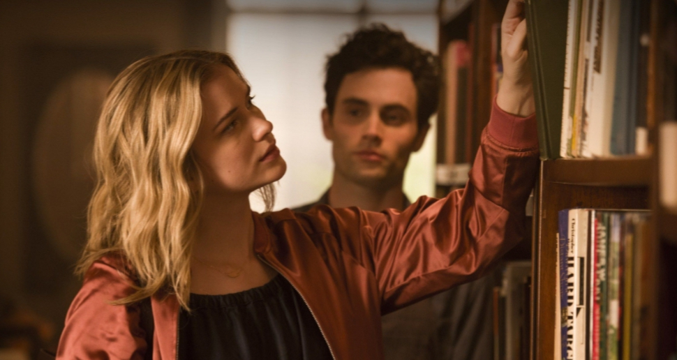

**Miray Zumrutel** 6 May 2020

_You_ is a crazy tale of obession full of sudden unexpected twists and turns that test the depths of human behaviour, all present beneath the pleasant exterior and inside the thoughts of Joe Goldberg, an innocent ‘next-door neighbour’, 'wouldn't hurt a fly' type of guy.

Joe is an everyday book store manager, a nice guy trying to live his life. But Joe has a little problem with obsession.

<figure>

<figcaption>

You can't judge a book by its cover

</figcaption>

</figure>

Played by Penn Badgley, we soon find out that Joe's flirtatious interest in one of his customers, the university student Beck (Elizabeth Lail) is not so innocent.

Joe is a manipulative stalker whose unhealthily obsession with Beck - the "You" of the title - knows no restraint and turns increasingly dark.

Joe, we find out, is a man with many secrets.

And _You_ keeps you constantly thinking about Joe's motives, because it is narrated through his thoughts. We literally hear his fascinating reasoning, how he convinces himself to do bad things - for the right reasons, of course. We hear his indecision, his considerations on the right thing to do.

And Joe's thoughts as narrator makes everything so much more exhilarating. You think that knowing his thoughts will let us know what's going to happen, but then the unexpected still keeps happening - and it still all makes a twisted kind of sense.

You are Joe; you will get an overwhelming rush and waves of fear as you go through events with him. It lets you in the character's mind and psyche and helps you understand exactly what they are experiencing.

But by being in Joe's head, we are constantly drawn to him. We sympathise, feel sorry for him, see how he suffers and his desperate need to be loved. And you will get a front row seat to every disturbing thought and on every dangerous decision.

And, after all, Joe would do anything for Beck. He would even kill for her, not that she asked him to. But maybe if he did remove one or two problem people from her life, perhaps Beck would flower?

And even though he drowns in his crazy thoughts and does bad things. I couldn't help think he might find redemption.

Even as Joe drowns in his crazy thoughts, perhaps there might still be hope?

I, and you too, will see how Joe is changing. Perhaps there is hope for Joe, you cannot help but think. Because Joe often shows he is caring, especially to young people around him ignored or neglected by the adults in their lives.

_You_ also made me think about the people around me - perhaps become a little paranoid. One thing for sure is that living in a big city, I'm definitely getting myself some curtains, blinds, maybe security cameras. And I’ll be careful who I get close to - are there real Joe's out there?

I would 100% recommend _You_ to you if you love a thrill.

**Available on:** Netflix

**Genre:** Psychological Thriller Drama

**Makes you feel:** concerned - all the time, not just when you are watching it

**Running Time:** 45 minutes an episode, 10 episodes a season (and **two seasons** so far!)

<figure>

<figcaption>

Hey you, watch You!

</figcaption>

</figure>
