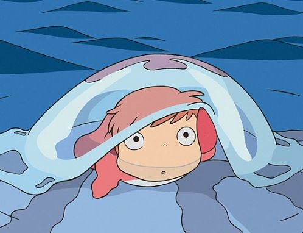
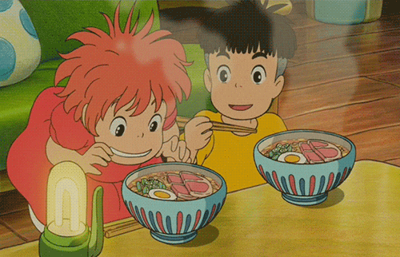

_Ponyo_ is about the innocent love felt by children, the importance of relationships and the need to accept that things change.

The film exudes charm and friendliness from its hand-drawn animations to the simplicity of the story.

<figure>

<figcaption>

  
  

</figcaption>

</figure>

This charm is aimed primarily at children but you too may recapture and lovingly recognise a child-like innocence in watching. It's very easy to let the drawings entice you into a blissful carefree state of mind.

_Ponyo_ (2008) is one of 21 feature-length anime films from Tokyo's Studio Ghibli who started in 1986. Ghibli has built a cult following around the world. Netflix stream all the movies worldwide except in the USA where you need HBO.

If you haven't seen Ghibli movies yet then you even more treats in store. Ponyo as beautiful as it is, is one of the lesser known. But even though others like _Spirited Away_, _My Neighbour Totoro_ and _Liliputia:Castle in the Sky_, are more discussed, I think this is a shame. I recommend Ponyo as a sublime introduction.

The story is about Ponyo, a young goldfish who escapes from the sea and befriends a five-year-old boy called Sosuke. Ponyo is desperate to become human so that she and Sosuke can be best friends and grow up together.

What could possibly go wrong?

Loads. Ponyo must first defy her grumpy and disapproving dad’s attempts to bring her home. But then it seems her absence has a much bigger effect on the world around. Without her magical presence there is a huge storm, which rattles and floods the island. Ponyo has to face-up to the consequences of her decision.

The love between Ponyo and Sosuke is so strong that she is willing to give up all her powers and disrupt the harmony of the island. This becomes an unforgettable adventure where only they can save the day.

And along the way the film speaks to us all about growing up, changing and accepting others for who they are and who they want to be. It makes you think again about relationships past, present and future.

Ponyo and Sosuke's genuine bond shines through. But the love is present throughout and there are no real villains. Ponyo’s dad is the antagonist but he clearly cares and is struggling with his daughter leaving their world. This simple clash of intentions where all want the best for each other is so refreshing to watch.

Since it was released in 2008 _Ponyo_ has had to compete for screens with films powered by an explosion of innovation in computer generated image (CGI). In 2009, for example, James Cameron’s _Avatar_ was blowing audiences away.

But Hayao Miyazaki, company founder and writer of Ponyo, and the Tokyo team have made a success in going against the tide. They still hand-draw every detail from the waves in the ocean to the grass on the cliff edge.

The result is a film of vibrant colours and beautiful landscapes. But more importantly of beautiful details and small observations which, especially in the less remarkable scenes, pull you in. For example when Sosuke and Ponyo are eating noodles together, everything from the patterns on the bowls to the different bits of food comes alive in the drawings.

One question you have to consider with the Studio Ghibli films is whether to view with the original Japanese voices and subtitles or else in the words dubbed into English.

Purists recommend Japanese and I sympathise – these voices are enchanting and musical and add lots to the movie. However, you may want to try the English dubbed version. Disney did the dubbing and used some famous screen actors. In _Ponyo_ English dubbed edition, Liam Neeson plays Ponyo’s dad – and it’s great choice.

_Ponyo_ is a special, magical and wonderful film which, over a decade after its release, still really deserves your love.

**Genre:** Animation, Fantasy, Comedy, Family

**Running Time:** 103 Minutes

**Available On:** [Netflix](https://www.netflix.com/watch/70106454?source=35)

