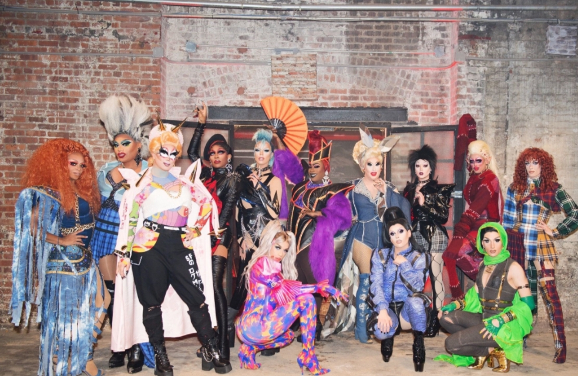
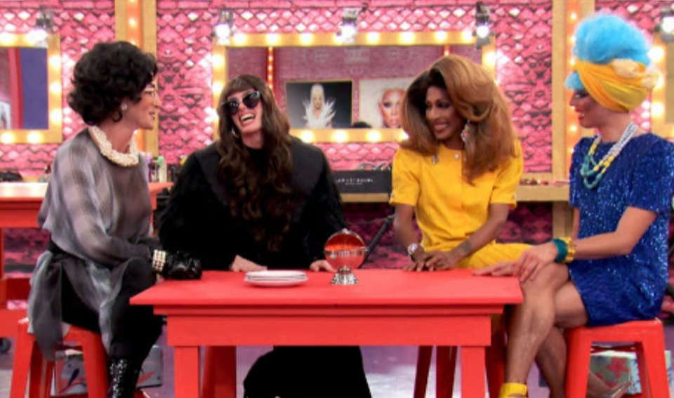

**Benedicty Sukama** 13 May 2020

_RuPaul Drag Race_ (2009-present) is a carefree, weird, flamboyant - and unmissable - reality TV talent show for breakout drag queen stars.

All 12 seasons, streamable now on Netflix, are jam packed with gay culture, colours, fashion and enormous personalities.

RuPaul, drag superstar, is the main judge, mentor and the one delivering the challenges to the wannabe winners of the competition.

The show asks the drag queens to dress up and perform in style in a series of inventive tests. These can be photoshoots, “readings” - a drag term for insulting another person's looks and mannerisms with a comedic effect, and even include a fair bit of acting.

Some challenges require contestants to design their own outfits with variable materials for a fashion runway. And whatever the costume they must still let their drag personas shine though and "wear the dress not let the dress where them".

It is fascinating to see them perform with music, comedy and in the infamous drag race “snatch game” - where the queens impersonate celebrities.

As with other talent shows each week a contestant goes home. _Drag Race_ has its own twist on this. The two weakest performers get a chance to change the judges' minds in - wait for it - a lip sync survivor battle, with various "vogue-ing" dance moves thrown in. (Do a little research on the New York vouging dance craze - it's pretty amazing.)

As a regular viewer, it allows me to enter the entertaining and fun world of drag.

But, more poignantly, you get to know these people on a personal level both as their drag personas and as their without-make-up real alter egos - and to hear their background stories of growing up being gay and living as a drag queen in America. But it avoids the cloying, mawkish sad-backstories you might find on other shows. Here the sentimentality is never laid on thick, unlike the make-up.

These star-wannabes tend to use drag to escape - to paint on a personality. And if you are given the freedom to choose a new personality then why not make that personality indomitable, outrageous and "[girls just wanna have fun](https://www.youtube.com/watch?v=PIb6AZdTr-A)"? And we can join them in their escape.

**Prepare to change your opinions about drag queens**

I'm pretty sure whatever opinions you had about drag queens, they will be changed after watching this show.

Some chocolate and a bottle of wine is all I need to binge and catch up with a new season!

I do recommend this show and I hope it will take you on a weird, wonderful ride.

**Available on:** Netflix

**Genre:** Reality TV

**Makes you feel:** Confident, happy and fascinated by the sparkly and exciting world of drag queens

**Running Time:** Approx. 45 minutes an episode, 12 seasons
