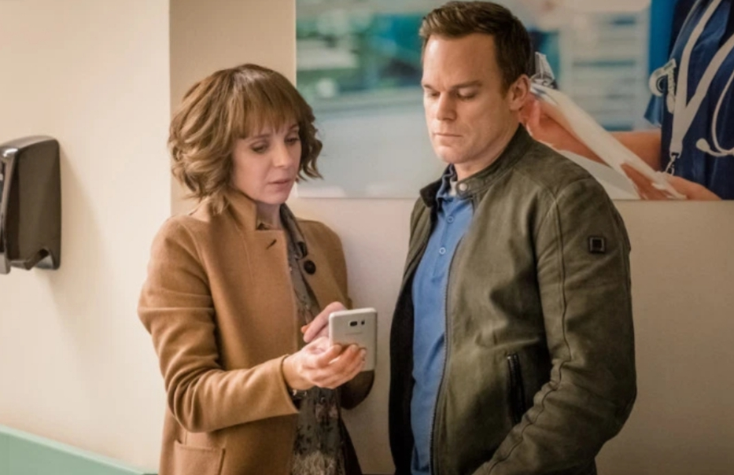

**Elena Donatone** 28 April 2020

If you enjoy suspense and working out who to trust then add _Safe_ to your binge-watch list.

_Safe_ is a British drama miniseries released worldwide on Netflix in 2018 and a creation of the crime writer Harlan Conbden. Set in the London suburbs, it focuses on the disappearance of a teenage girl, Jenny (Amy James-Kelly), and the lengths her father, Tom (Michael C. Hall), will go to find and protect her.

When Jenny and her boyfriend don't come back from a friend’s house party, it's frightening and mysterious. Tom and his daughter live in a gated community where security is on site at all times and CCTV is on 24/7. So how come no one has seen Jenny? In fact, it turns out many people have, but every member of the gated community has something to hide related to her disappearance, and even to her mother's past.  

The series is structured through several flashbacks and it takes you back and forth between the past and the present. The night of the disappearance is re-played from the different characters' perspectives.

Each episode adds new pieces to the puzzle of what exactly happened to Jenny and who is involved.

Michael C. Hall, formerly Dexter but now the dad, is simply brilliant. The pain and anxiety he portrays as Jenny's father will make you empathise with him and his family. Tom is neither a detective nor a cop - just a father - but his drive to find his daughter is at the centre of the series. Amanda Abbington also contributes greatly as the detective sergeant in charge of Jenny's case. She delivers a peek into the life of a woman who loves her job and family, and the sacrifices she has to make to keep both. These two powerful performances really make you care!

We meet many interesting and deceitful characters during the season - you won't know which to trust or to blame. And that's the best part of the show. Nobody is completely innocent, yet there is no obvious villain. Every character has a complicated background and will do anything in their power to protect their interests or those they love.

NOBODY SHOULD BE COMPLETELY TRUSTED

Many series nowadays have a villain and a hero, leaving no space for ambiguity and what people are really about. This series, on the contrary, shows you that nobody should be completely trusted.

The gated community Tom lives in is the centre of this hotbed of deceit. All the very rich and entitled families are somehow related to Jenny and her disappearance. They live in big houses and their children attend prestigious and private schools. They are all quick to judge and gossip, especially within the very snobbish Marshall family.

And that’s all you get at first, rich families that like to know everything about each other's life. But episode after episode, you will realise how many of those families would do anything to protect their loved ones and how wrong it is to judge someone before you get to know them properly.

The series is 8 episodes worth of drama and mystery. It will be hard for you to stop watching it after every episode, and you will find yourself yearning for more!

**Genre:** Drama

**Makes you feel:**

like there might be something going on in that gated community

**Running time:** 45 minutes an episode

<figure>

<figcaption>

Now watch it!

</figcaption>

</figure>
