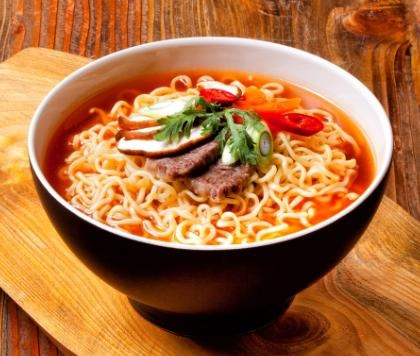
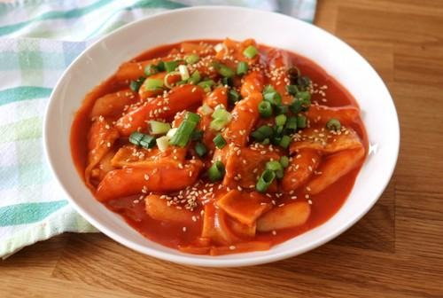
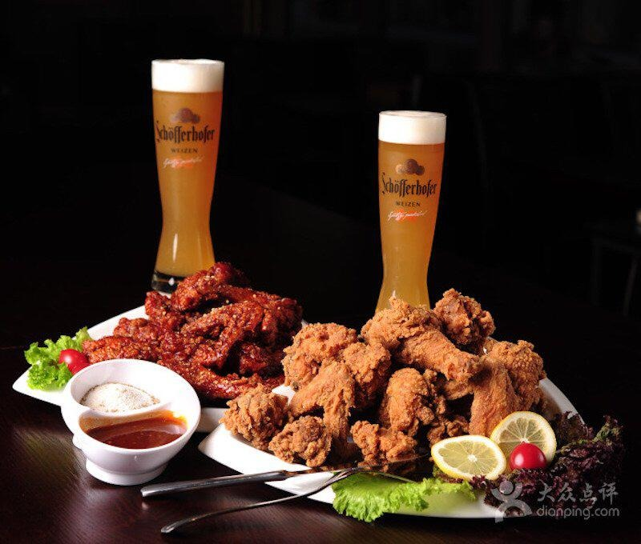

**Cinderella and her Four Knights** (2016)

This show had me craving **ramen noodles with cheese, and garlic spaghetti**.  
  
This is a modern riff on Cinderella with an ordinary young girl, an athletic high school student, who lives with three boys. There is a Prince Charming who is the fourth knight and evil step mother and sister plus various uncaring, exploitative rich folk.

But forget about the fairytale for a second and focus on the yummy food. It’s the scenes with ramen and cheese that have your stomach rumbling. When the lead has to get everyone to eat together, and my focus moved to their table of colourful dishes. The star on the table was the **bibimbap**, which is a bowl of rice served with **kimchi** (fermented vegetables), **namul** (sautéed and seasoned vegetables), **gochuchang** (chilli pepper paste), and fried eggs or beef.

The show is funny, cute and romantic, and overall the perfect watch. I don't want to spoil too much of the goodness, but let's just say your stomach will be rumbling after laying eyes on their dinner table. Try to watch without running to the shops for your own bibimbap. Watch on _[Netflix](https://www.netflix.com/watch/80188524?trackId=13752289&tctx=0%2C0%2C9fad261d-592d-409e-ab4c-c13b29965426-21585525%2C%2C)_

**Crash Landing on You** (2019 - 2020)

In _Crash Landing on You_, a South Korean a Chaebol (corporate) heiress ends up in strict North Korea after a paragliding trip and must disguise herself as a local while she works out how to get back home. This becomes a voyage of self discovery with romance involved, of course. As she falls in love with the a member of the North Korean elite, you might just fall in love with everything she eats. I’ve never had a craving for **burnt rice and sugar** until I watched this show. But the dish I craved the most from the show was a bowl of **ramen noodle soup and some crispy fried chicken**. This show presents us food from both the North and South of Korea. I bet that by the end of the show you will be googling Korean restaurants near you, so you get to try the delicious fried chicken with a special red sauce for yourself! Watch on _[Netflix](https://www.netflix.com/watch/81205759?trackId=13752289&tctx=0%2C0%2C094ce0a2-8104-461c-82c3-8ac17315647b-529101746%2C%2C)_.

**Oh My Venus** (2015 -2016)

This show presents the life of a Kang Ji Un, Ji Un a slim Korean woman was in a stable relationship of 15 years. But then she started binge-eating junk food and gained weight every day. This new lifestyle of hers lead to a break up. So she calls in professional help to her turn back into the goddess she once was.

_Oh My Venus_ has it all...comedy, drama and visual treats aplenty. This show presents different types of Korean cuisines, from unhealthy binge-eating on **tteokbokki** (Stir-fried Rice Cake), **sundae** (Korean sausage), and **fried chicken**, to healthier options such as **chicken salads**. This show has you craving to junk food, but the chicken salad encourages you to hit the gym right after you've watched the show. Watch on _Netflix_.

**Kim’s Convenience** (2016 - present)

_Kim's Convenience_ presents a Korean Canadian couple who running a convenience store in Toronto to build a better future for their children. This show explores what is like adapting to life in a new country - and food often lets immigrants keep a tie to their original homeland.

The **galbi-jjim** (beef short ribs) that the father (or "appa") of the family cooks looked so delicious it made me pause the show to find a recipe. There is also **kimbap**, which looks similar to sushi, just bigger. One thing I enjoyed seeing in the show was Janet, one of the children, and her mother cooking together including **bin dae duk** (mung bean pancakes), which I want to learn to cook myself! I can promise you this show will have you buying ingredients and messing up Korean dishes in no time. Watch on _Netflix_.

**My Love from the Star** (2013 - 2014)

This sci-fi Korean show has an alien who gets stuck on Earth trying to help a young girl from falling off a cliff and then falls for his next door neighbour. Dumb aliens. The show is a perfect romcom. But again, let's talk about the food.

Chicken and beer features heavily in the show. This is known as **chimaek** in Korean, a word made by combining the English word chicken and the Korean word maeksu meaning beer. This show had me craving soups, seafood and most importantly, some **chimaek**. Watch on _[Netflix](https://www.netflix.com/watch/80025073?trackId=13752289&tctx=0%2C0%2C0457f85e616bf23bbd798e85426fbda6d6cf12bf%3Aaf9b8e98db1c84564559ede884ed9b8076d82205%2C%2C)_.

