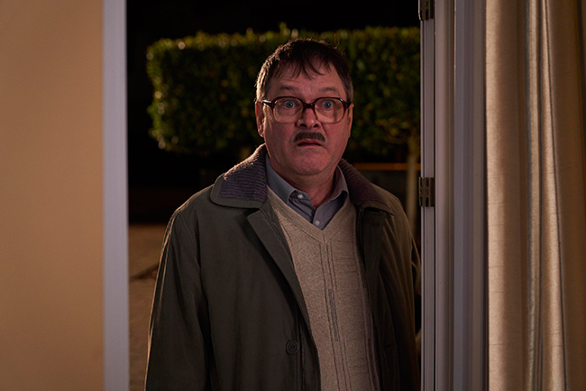
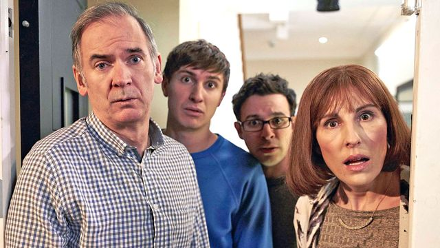

**JamieBrown** 23 May 2020

Shalom! Each Friday night we are welcomed into the Goodman’s household to find out how they manage to spectacularly derail their traditional Jewish family meal. And it is Jewish, sort-of, but really its the traditional Sunday lunch on a Friday night.

_Friday Night Dinner_ (2011-2020) makes the normal - okay the slightly eccentric - hillarious. Plotliines can range from a spill on the carpet, to throwing away old magazines, to a new caravan, to new girlfriends for the boys - but these test how the family puts up with one another and whether they will, finally, get to sit down to eat. And so what the show so often really captures along the way is how excruciating family life can be.

The mother, Jackie, is supposedly in charge of keeping everyone in line, while the two sons, Adam and Jonny, return home to wind up and perform a range of near violent humiliating practical jokes on each other. Last but not least, their slightly deranged father, Martin, emerges blinking from his own world of eccentricity.

But it’s often Jackie’s obsession with the distractions of family and friends that causes the dinners to unravel. The men of the family are desperate for the food no matter what - for Martin and the boys, Friday night dinners are the best thing in the world.

And, no matter what, the the family’s crazy neighbour Jim Bell and his dog, Wilson, pay an unwanted visit. Jim has weird and wonderful reasons to call whether to warn them Wilson has been for “dollops” in their driveway or to use their fire extinguisher after his elm bath caught on fire. You get the picture – Jim is slightly mental!

At one stage the boys wind Jim up by making up a host of Jewish traditions - you can only eat green fruit on the Sabbath, apparently. This backfires, naturally, because Jim has no sense of proportion. Jim starts greeting everyone by saying, “Shalom!”, bringing a home-made yarmulke (a Jewish cap) made out of his shirt and smashing a plate – as he mistakes the Greek tradition as Jewish. He also drinks “Jewish water”, which he once again mistakes for a tradition after watching Jonny pouring salt into Adam's water as a prank.

There is nothing special about their dinners, except for it being the same cooked meals all the time. Ultimately, it is just an occasion for the family to meet up every week. As its the same meal the same jokes are trotted out each week, Martin: "Lovely bit of squirrel Jackie."

This is slapstick comedy in real life scenarios with a twist of eccentricity and dabs of realism.

Warning: this bunch of typical nutters may will win a place in your heart. Now pass the crimble crumble, er I mean apple crumble.

**Available on:** Netflix and 4oD

**Genre:** Sitcom

**Makes you feel:** hungry

**Running Time:** Approx. 20 minutes an episode, 4 seasons on Netflix
