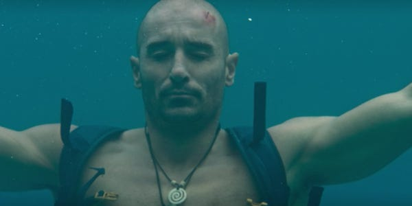
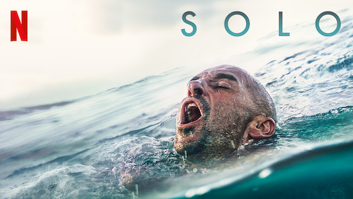

**irmak** 21 May 2020

The pandemic lockdown and social distancing is making us appreciate how important human company is.

So, spare a thought for Alvaro Vizcaino in _Solo_ (2018).

Alvaro is a surfer who falls off a cliff. I know – he won’t catch many waves on a cliff. But seriously, you have to trek over difficult territory to get to those special beaches. And, this is based on a true story.

He is Spanish and experiencing the paradise of the Canary Islands. But alone, injured that paradise turns to hell. And Alvaro, played by Alain Hernández, must try to survive, seriously injured, alone, until help might arrive.

The expression is that someone’s life flashes before their eyes and this is where the film takes us.

**This movie is moving because is re-reminds us life is too short to hang on to all the grudges and sad memories**

The film recounts why Alvaro is alone. The night before the accident, he discovers his best friend is moving to Canada to start a new life with his girlfriend. Alvaro is perhaps selfish and he reacts childishly to the news. He doesn’t want his friend to leave, gets drunk and starts a fight.

His solo survival makes him think about his life, who he owes apologies to and what a selfish person he is.

Added to the self-doubt and recrimination, Alvaro is hallucinating too.

There is not even a single person there to help him, dehydration is making him lose his mind. He is even drawn to think whether there is any point drawing out the misery and pain before death.

In our currently enforced isolation we have been reminded just how precious socialising is.

We are stuck at home dreaming about going for a drink with our friends, or something so simple as shaking a friend’s hand. Even going for a walk can seem pointless without company.

Sure, Alvaro is a bit worse off, but we can understand his pain.

He is desperate to see his family; his friends and he wants to go back to his normal life. We want our normal lives back; we miss our family and friends too.

This man is in a desperate search for food and water and these things are essential. But toilet roll is pretty important, too. No? We thought it was the end of the world, so we started fighting over toilet paper because what's more important than gently wiping your ass?

But, jokes aside, being stuck at home has reminded us that life is too short to hang on to all the grudges and sad memories we retell ourselves and this is why this movie is so moving because you and I are able to deeply relate to it.

Some of us have lost our loved ones to Coronavirus and some are still fighting for survival, or some are scared for their life. But the only way to get through this pandemic is by believing in yourself – and that your links to friends, family, colleagues will be restored.

Like this surfer, we should never stop believing we will meet each other again one day. We all have our own survival stories and every so often we sink, but most of the time we manage to float with the tides, soon we’ll be up there on the crest of a wave!

Stay safe, stay positive!

**Available on:** Netflix

**Genre:** Drama/Romance

**Makes you feel:** the yearning for your fellow man

**Running time:** 1 hour, 30 minutes
