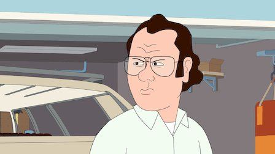
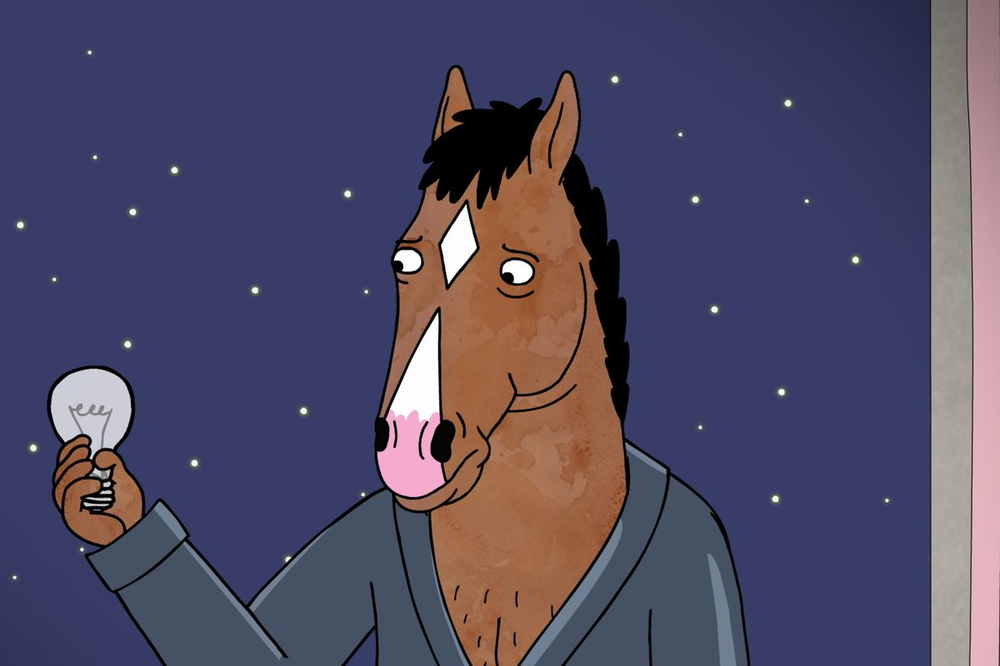
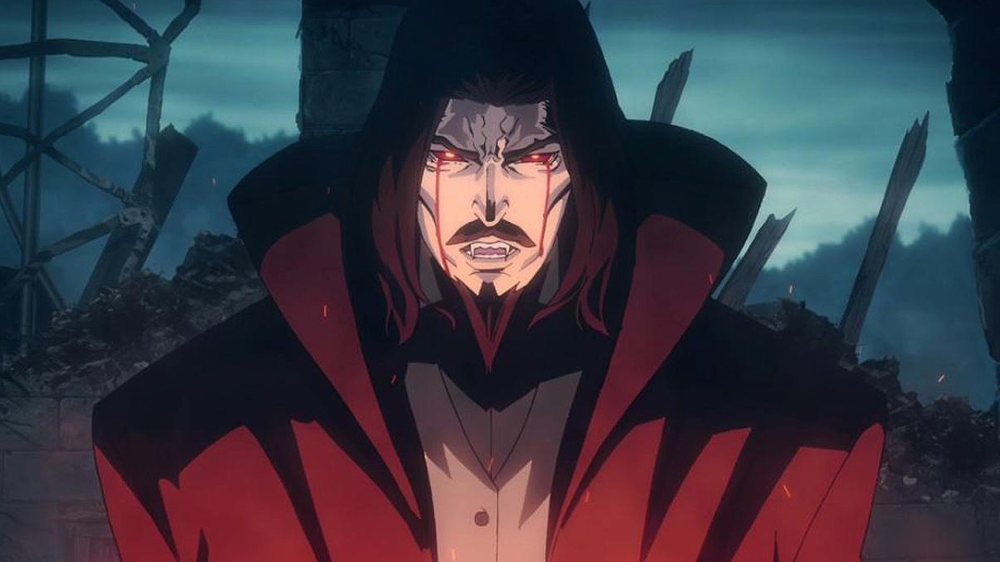
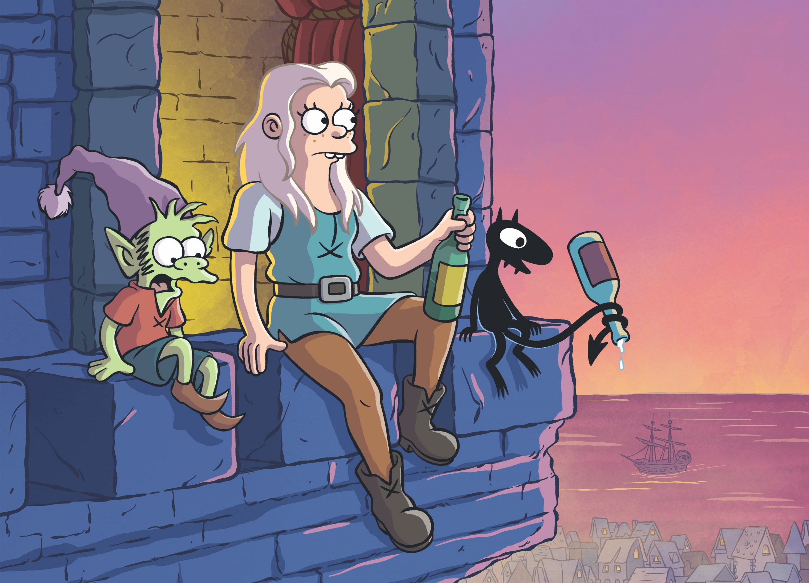

Dont normally watch animation? Here are four toons that will change your mind. I promise.\*

_F is For Family_ - watch it or I'll throw you through the wall

_F is For Family_ (2015 - present) is fu\*king awesome! This splendid raunchy comedy, set in the 70s, is inspired by stand-up comedian Bill Burr's childhood. Burr is a funny guy and his stand-up specials and podcasts are worth checking out. Plus he was in an episode of Star Wars _Mandalorian_!

This show is about Frank and his lower-middle class family (US-speak for poor). Frank hates his life, his job, and often his kids. He loves his wife though. So when he let's anger explode at her and she becomes upset, he desperately tries to win her back - cluelessly.  
  
Frank is a seething ball of frustration who you may not like at first. But, as you see his life, sympathy and understanding follow. There's a fair bit of social realism here.

You will laugh at his go-to parenting technique: the threat to throw his kids "through the wall". I'm told this threat happened a lot in the 70s. But he - and the kids - know its not physically possible.

Plus Frank's "dad jokes" are hilarious.

_BoJack Horseman_ \- Equine everyman

      

Hi, I am BoJack, Horseman. BoJack is everything you need. BoJack Horseman, the humanoid horse who is lost in the sea of self-loathing and melancholy, will give you hope. BoJack Horseman is trying to live his life while staring into the meaningless abyss of the universe and its indifference every day.

And his friends, and colleagues who all become friends, and the jokes about the world of humans coexististing with humanised animals and the super fast, smart socially and culturally self-aware dialogue is - in 80s speak - rockin'

When the show ended I felt lonely. BoJack became my friend. I loved that he never gave up trying to find a purpose to life.

The show will teach you how to find yourself. It will give you examples of how you can lose yourself on the way. But most importantly, it will remind you that no matter what your goal is in life, you will achieve it in the end because, “every day it gets a little easier, but you gotta do it every day”. I cannot explain how amazing this show is, you really need to see it for yourself.

_Castlevania_ - gothic epic

Yeah the title is naff. But dont let that put you off.

_Castlevania_ (2017 - present) is a gothic epic with the wow factor. It creates a medieval world where humans must justify and fight for their existence - or escape it all with booze - when around them vampires, less numerous but more powerful, plot to rule and cull their human prey.

In the story a human woman who wants to learn science wins Dracula over. They marry. She becomes a doctor. The church burns her at the stake for witchcraft. Dracula, lost in grief, decides humanity must die for this sin.

Based on the popular video game series, its has flawed heroes and baddies, a powerful and novel plot, and stunning artwork. It really is possible to lose yourself in just the scenery.  
  
So far we have three seasons, with 30-minutes an episode.

_Castlevania_ will leave you feeling hopeful, merciful, and grateful.

_Disenchantment_ - Simpsons in Dreamland

Wanna disconnect from reality and delve into a dreamland full of questing? This vacation is 30-minutes a pop. _Disenchantment_ (2018-present) is located in the medieval kingdom of Dreamland and is a Matt "The Simpsons" Groening production.

The adventures are led by Princess Bean and her little crew of ELfo the Elf (did you guess?) and Lucy the creepy, cute little devil. This wild trio explore and rebel in equal measure. Expect an adventure and an unsolved puzzle every episode. _Disenchantment_ will not disenchant you!

\* No monetary value is implied in this guarantee. Product may vary according to your level of taste. Clicking like on the "thumb" required.
