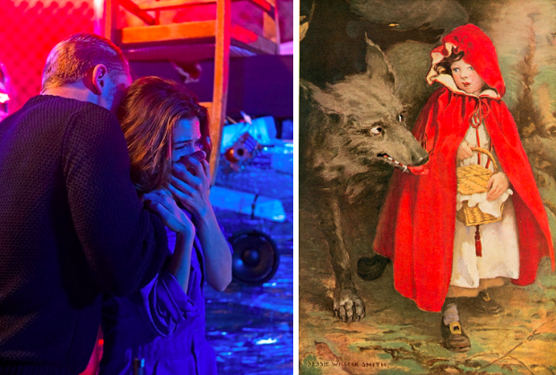
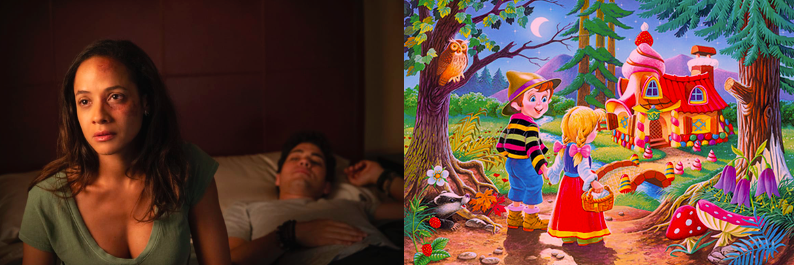
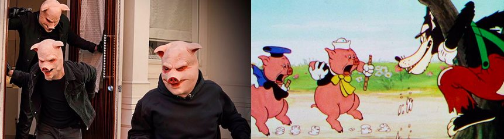

_Tell Me A Story_ (2018-present) is an American psychological thriller based on _Little Red Riding Hood_, _Hansel and Gretel_ and _The Three Little Pigs_. The second season revisits Disney classics to combine _Beauty And The Beast, Sleeping Beauty_ and _Cinderella_.

One warning: I watched this in Norway under lockdown. There is not yet a UK distributer. It's only a matter of time - and I will update you here. But, currently, it's [DVD mail order](https://www.amazon.co.uk/Tell-Me-Story-Season-One/dp/B07TMRS3BD/ref=sr_1_2?crid=T1J7L2J4MJKR&dchild=1&keywords=tell+me+a+story+season+1&qid=1588549567&sprefix=tell+me+a+story%2Caps%2C148&sr=8-2) only in the UK!

This suspenseful thriller tells three parallel stories in each season. The first season is set in New York, and the first story is about Kayla (Danielle Campbell), a 17 year old girl who just moved to New York from California to live with her grandmother after her mother’s death. After sneaking out to go clubbing with her new friend Laney (Paulina Singer), she meets a handsome stranger (aka wolf) with bad intentions, Nick (Billy Magnussen), who takes her to his home under the influence of drugs and alcohol.

Kayla's story channels _Little Red Riding Hood,_ where a naive teenager gets persuaded into a stranger’s life_._ Kayla’s red raincoat and grandmother, who she struggles to connect with at first, make it visually easier for the audience to see the connection.

- 
    

The second story of Gabe (Davi Santos) and Hannah (Dania Ramirez) is about two siblings who reunite after Gabe accidentally kills someone. In order to escape trouble, they end up spending the victim’s money to get away. However, when people come looking for the victim's massive bag of money, Hannah hides it, leaving breadcrumbs so the siblings can find their way back to it.

- 
    

Finally, the story of Jordan (James Wolk) plays with the audience’s emotions from the first episode where he gets caught up in a tragic robbery executed by three men wearing pig masks, which ends with the death of his fiancé, Beth (Spencer Grammer). The pig masks of the robbers and Jordan's seach for his fiancé's killer reverse _The Three Little Pigs,_ where the pigs are portrayed as the bad guys instead of the wolf.

- 
    

What makes this show really worth watching are the elements taken from some of the darkest fairy tales we are familiar with, turned into three realistic stories that bring up real life matters such as love, lust, anger and revenge.

Each episode starts with the artistic two-minute intro, that for a change is difficult to skip, of an animated sequence of the three fairy tales that you're about to watch.

REALITY IS FAR FROM A FAIRY TALE

According to the lead in the first story, Danielle Campbell, the stories are a darker recreation of the fairy tales. Their goal appears to be telling the audience that reality is far from a fairy tale, by adding real life issues to the show such as the lack of money, drug addictions and death. This is evident in Jordan’s story when his perfect life as the owner of a luxurious hotel turns upside down when his fiancé is brutally murdered. Before the burglary, Beth also mentions she does not want to bring a child to this cruel world, despite Jordan’s wish to have a baby of his own.

The switch between the three stories during each episode - with numerous cliffhangers - leaves the audience waiting for their favourite story to return. Additionally, each episode has a suspenseful ending, which makes the show worth binge watching. The best part is that the stories intersect at some point in the show where the characters from the different stories come together!

With a star cast including James Wolk from _Mad Men_, Danielle Campbell from _The Originals_ and Paul Wesley from _The Vampire Diaries_ playing their famous fairy tale roles as characters in a thriller, I was instantly drawn to the show and binged watched my way through the first season! I think you may too.

**Available on:**  
DVD (and HBO Nordic, CBS USA)

But watch the credits now:

https://www.youtube.com/watch?v=-fHfYWTDsD4

**Genre:** Psychological Thriller

**Makes you feel:**

like fairy tales might have been more scary than you remember

**Running time:** 50 minutes an episode
