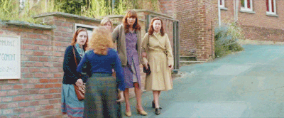

Ignorance and prejudice are not always grim. It turns out they can be very funny too – especially in retrospect.

_The African Doctor_, a French movie, retraces the true story of a Zairan doctor who decides to move to very white 1970s rural France and recounts his humorous journey to integration.

Directed by Julien Rambaldi and released in 2016, the movie is about Seyolo Zantoko who settles in a little village with his family in the north of France.

<figure>

<figcaption>

Dr Zantoko on the left, Kamini in the middle, Sivi in the background and Anne on the right.

</figcaption>

</figure>

It all starts at Seyolo's graduation party at a French university with his confrere – or fellow professionals. To stay in France he decides to apply to be the GP of the village of Marly-Gomont and contacts his family in Zaire (now the Democratic Republic of Congo) to join him.

His wife, Anne, and two children, Sivi and Kamini are happy to join him as they think they are going to live a European fantasy life. But this little village is not glamourous Paris. They mix with cow not sophisticates. They are far from the capital, and encounter racist remarks and stereotypes from the villagers who are encountering black people for the first time.

<figure>

<figcaption>

Villagers's reaction as Anne, Sivi and Kamini walks...

</figcaption>

</figure>

The movie shows the hard side of the Zantoko's integration but laces this with humour. As a true story this makes the events even funnier but also sadder to think of the obstacles they had to overcome.

It also shows how far we have come in terms of mentality, and stereotypes against each over.

I guess the example of Dr Zantoko changed not only habitants of Marly-Gomont but also villages surrounding them towards people of colour.

Anne Zantoko, the wife, is my favourite character. Anne's hilariously plays the stereotype of African mothers to perfection. She tries to integrate into a new environment but keeps her habits and doesn’t forget her culture. It made me appreciate how she maintains herself while adjusting to the new. She is proud of her culture and is not afraid of showing it.

In one scene Seyolo is upset when the locals sing a Congolese song at church. But this makes Anne angry at Seyolo – is he disowning his background, even forgetting he is black? Anne admirably keeps her household together with bravery keeping sight of where they are from even as they become part of a new community.

_The African Doctor_ is a movie which is relatable to lots of people of colour who have moved to European countries in the 70s or 80s which makes it even easier to understand the journey of the Zantoko's as it is one among many cases.

It discusses racism and shows how hard it was to live through. The problems villagers had with Dr Zantoko were not because of his qualifications but because of his skin colour. This got to the point that they did not go to see him and so he was not getting paid. Although going through this must have been hard, the result was a success and perhaps that is what really matters.

The movie is in French with English subtitles. Maybe a bit tiring to watch but well worth it.
