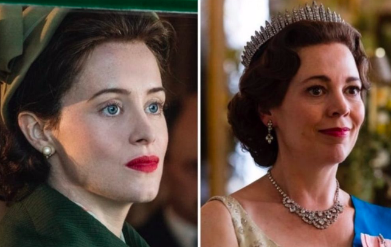
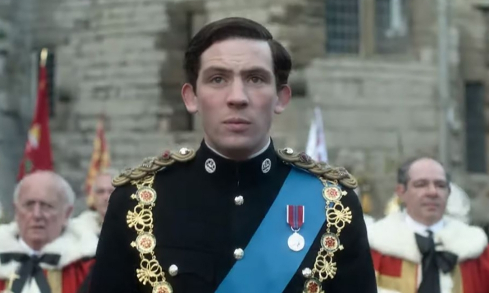
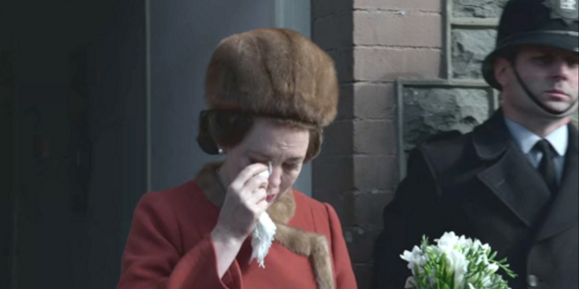
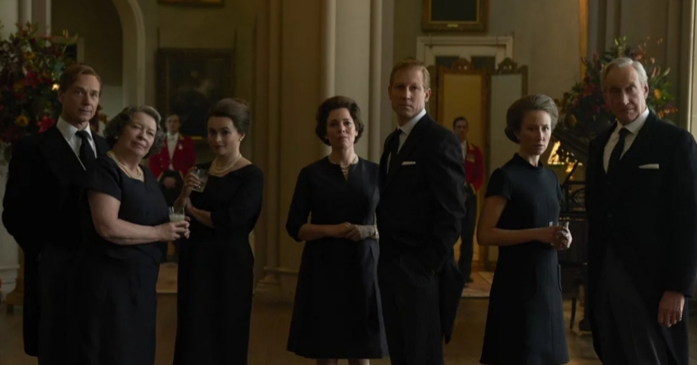

**Elena Donatone** 28 April 2020

If you have never particularly understood the hype around the British Royal family and its queen, I'm sure The Crown has never been on your binge-watch list.

But what if I told you the royals form just part of an entire world of history and political scandals that awaits you? Season three of _The Crown_ is by far the best, praised both by critics and viewers. It was released at the end of last year and it surely is a masterpiece!

An entire world of history and political scandals awaits you

The new season, once again follows the life of Queen Elizabeth II and her reign, in the course of 10 episodes. While the first two seasons saw the queen as a young monarch, from her wedding with Prince Philip to her first decade as queen, season three presents an older Elizabeth, “Lillibet” to her closest relatives.

Even the actress has changed to symbolise the shift from a young and inexperienced queen to a more confident and stoic one. In the first two seasons, the queen was brought to the screen by the talented Claire Foy, whereas in season three, the Academy Award Winner Olivia Colman takes over. Her performance as the queen is nearly perfect and every aspect of her, from the walk to the voice reminds the viewer of the real-life ruler.

Although the series follows the reign of Queen Elizabeth and Oliva Colman does a great job in portraying her, it feels like her role is often secondary in these new episodes. Many characters that weren't the centre of _The Crown_ in the past, now are very important to the plot, even more than the queen. And the events they witness and take part in are just as interesting!

An example is the character of Prince Charles. While in the first two seasons the Prince was present only as the Queen’s son, in season three, his story has more depth and importance. An entire episode, “Tywysog Cymru”, is dedicated to his university term in Wales to learn the language before his investiture as Prince of Wales. The episode shows a more mature heir to the throne, willing to defy the traditional monarchy and his mother.

  
The fourth episode of this season, “Bubbikins”, is also proof that interesting characters are often far from the monarchy and what it stands for. The episode is centred around Princess Alice of Battenberg, mother of Prince Philip. Princess Alice (Jane Lapotaire) is a great character who is very much the opposite of what the royal family represents. This episode is a tribute to her life and willingness of overcoming obstacles. From her years institutionalised and tortured by Sigmund Freud to her becoming a Nun in Greece _—_ Alice is a character that you will surely root for.

  
Secondary characters weren't the only great aspect of this season. History was the centre of The Crown as well. In season one and two, famous historical events were portrayed in many episodes, but season three will have you learn what they never taught you at school.

  
A great episode for all history lovers out there is “Moondust”, which takes place in July 1969 _—_ when the first men land on the moon. The episode shows the excitement that was brought to the world that week and how most people, including the royal family, were glued to the screen to watch every second of it. From the interviews with the astronauts before the trip to the landing on the moon.  

An episode that shows a side of history not many people are aware of, but nonetheles important, is “Aberfan”. The episode follows the collapse of a mine waste tip in the town of Aberfan, Wales, which hit a primary school and saw the deaths of more than 100 children. The episode captures the pain and loss the town experienced because of that tragedy and the lack of response from the queen. The monarch decided to visit the town only days after the tragedy, although the Prime Minister Wilson asked her to go sooner. According to people close to the Queen, as seen in the episode, her late response to the tragedy is the biggest regret of her years as ruler.

  

The new season of _The Crown_ is surely a must-watch and as season four is already under production, why not try and immerse yourself in a drama full of history and scandals? It won't let you down. And why not? You might even end up liking the Royals and their Queen a bit more!

**Genre:** Historical drama

**Makes you feel:**

like you are watching history being made

**Running Time:** 50 minutes an episode, 10 episodes a season

<figure>

<figcaption>

Now watch it!

</figcaption>

</figure>
