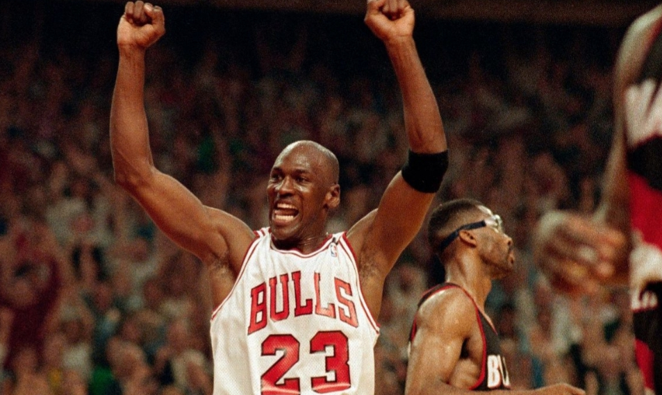
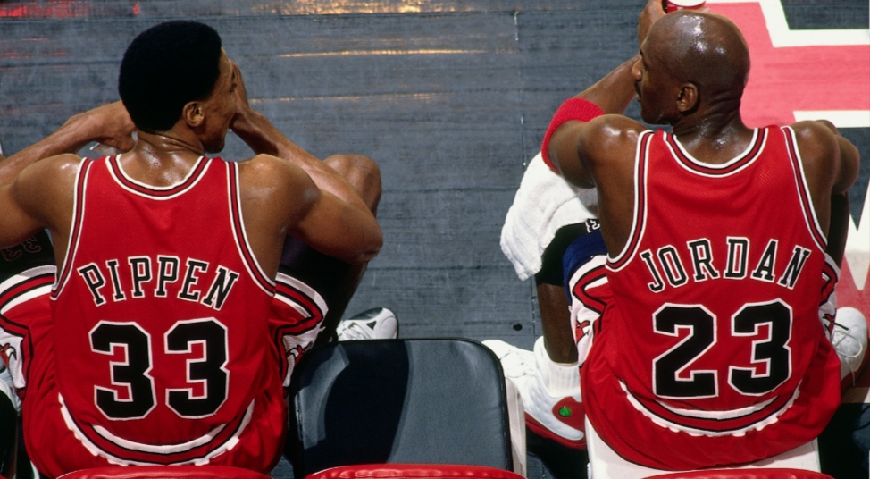

**Pedro** 19 May 2020

You might know very little about basketball or even care very little about sports.

So what?

_The Last Dance_ (2020) is a docuseries that’s still worth your time, one that everybody is talking about, and a ten-episode work of art from ESPN and Netflix.

_The Last Dance_ is about the 1997-1998 season of the Chicago Bulls, a team that had won an already unprecedented five NBA Championships in the last seven years. They had talented stars but they were ageing, and there were bitter disputes and questions over motivation.

Management were poised to cast out the current players and rebuild. The team was lining up for a last chance for an amazing sixth championship or, what seemed more likely, a spectacular collapse.

It tells stories of individual struggle and determination, group conflicts and dynamics, how power, money, ambition and sporting talent jostled together, and how a host of people fought to leave their mark on the world. All through a season of basketball.

It uses locker room footage, comments from a line-up of sharp savvy sports journalists, the recollections of those involved and their rivals, and countless expressions and faces – of fans, athletes, coaches and managers.

What often makes this so good is the weaving together of so many stories to explain and explore the struggles, the personalities and the difficulties.

This can happen because of the pivot at the documentary and the team’s core, Michael Jordan. Jordan was, and still is, considered one of the most talented sportsmen of all time, the greatest basketball player ever. In the mid to late 1990s, he was considered the most famous person in the world – and he shifted a lot of Nike Air Jordan sneakers. And, as the documentary takes you into his head, you can see he is one of the most determined people on the planet.

But back to 1997 to set the scene more completely. Starting the season the Chicago Bulls were in difficulty.

Sure, the team had Jordan and included a host of talents and personalities including Scottie Pippen, one of the NBA greatest ever players, and Dennis Rodman, defensive guard, crossdresser and later buddy of North Korea’s Kim Jong Un.

But Pippen was long under-paid after he accepted a long-term deal to guarantee helping out his huge poor family and disabled father – and he started the season with surgery. And Rodman would sporadically disappear, including having a mid-season vacation to “be himself”.

And Jordan too had been away. After his father was murdered in 1993, he had quit basketball in 1994 spent 18 months pursuing the dream of a baseball career that he had abandoned as a schoolchild. This was seemingly to fulfil the earlier wishes of his father – much more a baseball fan.

The team were ageing – Jordon, for example, in his mid-30s. The coach had been given one final year by management. They already had success, money. Could they regain the motivation, fight off hungry rivals, or even just get it together?

As the season begin, Phil Jackson Chicago Bulls team coach tried as he had in previous seasons to give a name to their year ahead, to set the tone. This year, printed on a binder given to each player, his attempt was: “The Last Dance?”

So, would they fall flat on their faces or get their Last Dance after all?

**Available on:** Netflix

**Genre:** Sports Docuseries

**Makes you feel:** like you're inside Micheal Jordan's head and like you are part of the team!

**Running Time:** Approx. 50 minutes an episode, 10 episodes
