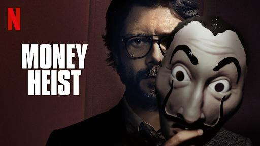
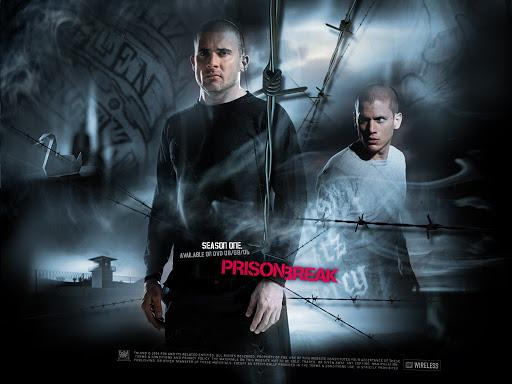
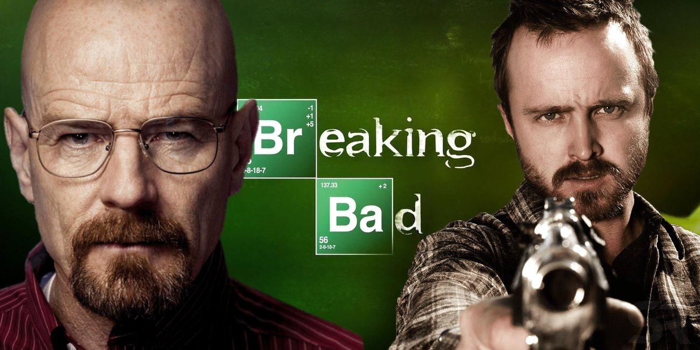
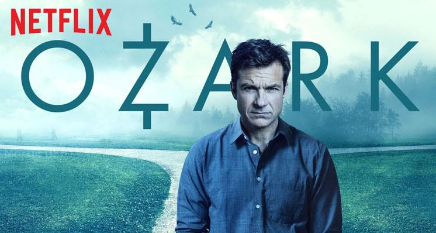
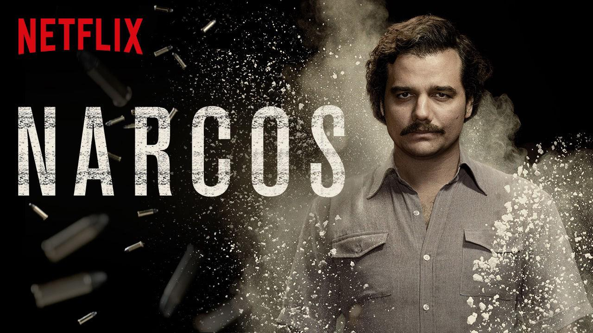

One thing you can say about bad guys: they are never boring. Here are 9 of the best!

**1.** **The Boys**

In a world where superheroes fight for justice, save lives and sacrifice themselves to save the world, they may have the power of the gods, but they may not be as super as you think. With great power comes great responsibility? No, with great power comes absolute corruption. In this world superheroes only care about their reputation and how to make a profit. But not as long as The Boys are around. A group of humans who have a beef with the "sups" and aren’t afraid to stand up to them. Watch as The Boys destroy everything you ever believed about superheroes. Action, comedy, drama and a real don’t give a f\*\*\* attitude. The Boys, rated R. Available only [on Amazon Prime](https://www.amazon.co.uk/dp/B07QRW375W/ref=dvm_uk_sl_tit|c_419893505687_m_95087911625805135229491-dc_s_).

**2\. Money Heist**

Tokyo, Berlin, Denver, Helsinki, Nairobi. These sound like great tourist destinations or they may be the perfect pseudonyms for heisters. Meet the team of criminals that will suck you into their world of bank robberies. See the story told from their point of view and marvel as their plan becomes crazier and crazier. See them up close and personal and get to know them to the point where you will have a major case of Stockholm syndrome. Join the gang [on Netflix](https://www.netflix.com/title/80192098).

**3\. Prison Break**

What would you do to save a loved one who is being sentenced to death? You may not know, but Michael Scolfield is going to try and break his brother out of prison. He is an architect who discovers his brother was falsely accused of a crime he did not commit. After studying the prison plans, he has to fight against time to save his brother’s life before it is too late. Enter the mind of biggest strategist in the world and see how he handles the ruthless world of Fox River prison. This is the series that will keep you locked up on your seat until you and paranoid in the shower at the same time. So, close the doors and throw away the keys as you are going to be watching this [on Netflix](https://www.netflix.com/title/70140425).

**4\. Breaking Bad**

  
Chemistry teacher Walter White is dying of cancer and must make money for his family fast. This is when he decides to "break bad" and enter the meth business. Watch as White turns from a simple family man to a drug lord. Action, deception, drugs, corruption and five seasons worth of fun! You can catch this critically acclaimed series [on Netflix](https://www.netflix.com/title/70143836).

**5\. Dexter**

  
If you are a criminal and you think you got away with it, think again. Dexter Morgan is a well spoken, friendly, well dressed, smart forensics scientist. The model citizen but also a serial killer. Yes, a serial killer, but not like others. As a code Dexter only kills those who escape justice. Blood, gore, an insight into the mind of a killer and sunny Miami beaches. This is what awaits you in this must-watch series. You can watch him "wrap up" his victims [on NOW TV](https://www.nowtv.com/watch/dexter/8d7b94be895d2510VgnVCM1000000b43150a____).

**6\. Mr. Robot**

  
Computers run our whole life and nobody knows you better than them. Except for Elliot Alderson. He is a hacker who can give Anonymous people a run for their money. Anything that has a chip is not out of his reach. He is a cybersecurity engineer by day and a vigilante and hacker by night. A techno thriller that will keep you on the edge of your seats and that will make you think twice before turning on your computer. Funny enough, if you want to watch it, you can find it online [on Amazon Prime](https://www.amazon.co.uk/eps1-2_d3bug-mkv/dp/B015RPBSAI/).

**7\. Ozark**

The Ozarks are known as a great place to spend the summer holidays. Warm lakes, beautiful forests for hiking, friendly locals, a fun place for the whole family. Is this all true or is this all just a front? Marty Byrde is an accountant that works for the Mexican cartel. After watching his partners being executed for betraying his boss, Marty is given one more chance to prove himself and make the money that he owes. This is the story of a man that who will do anything to save himself and his family. With twists at every turn, this crime drama can not be missed. Watch money being laundered [on Netflix](https://www.netflix.com/title/80117552).

**8\. The Punisher**

  
Frank Castel was US black ops. He was the man that loved his family more then anything. He was the man that lost his family to gangs. He is the man with nothing to lose. If you like living life on the wrong side of the law, the Punisher will come for you and he is not taking you out for ice cream. Watch as he punches, kicks, stabs and shoots criminals into swiss cheese. Come and watch the hero Marvel forgot to give a cape to [on Netflix](https://www.netflix.com/title/80117498).

**9\. Narcos**

  
Pablo Escobar, a name known by many. To some he was a hero to others the biggest drug lord in all of human history. Step into the world of Narcos and meet the man himself. Watch as a man turns drugs into money, corruption and death. Watch as the Colombian cartel took over the cocaine business and even in the end you will ask yourself if you will take “money or lead?” Watch this incredible, true story [on Netflix](https://www.netflix.com/title/80025172).
