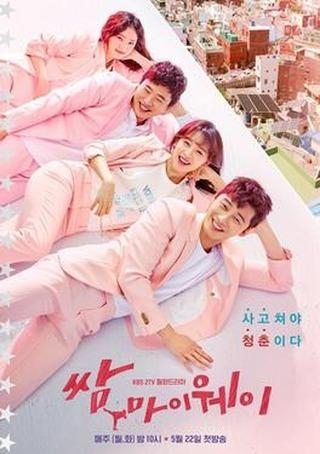
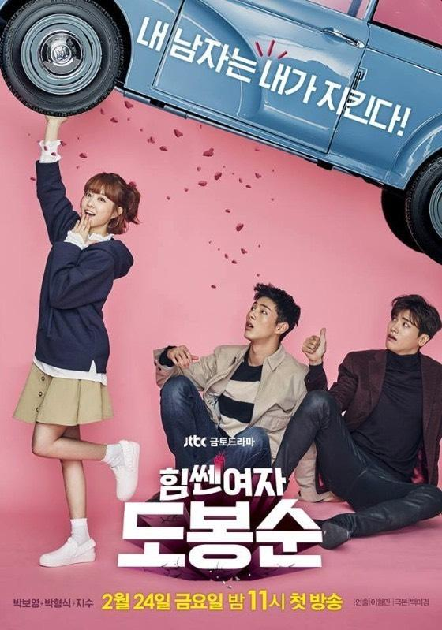
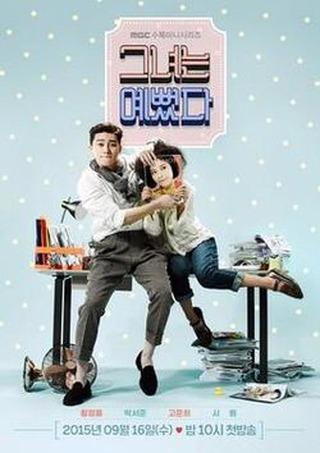

Here are four available-on-Netflix K-Dramas I would recommend for beginners. They will take you down the rabbit-hole of Korean craziness. Dont let me say I didn't warn you.

**Fight For My Way**

Four best-friends tackle the problems of daily life while trying to keep their dreams and have love lives. Yeah I know, it might seem serious - but after all this is also close to a description of _Friends_!

The characters and the bickering between friends is what makes this so funny and entertaining. Plus there are also some cool MMA fight scenes.

Just for example, Choi Ae-Ra calls herself a “psycho” to keep annoying men away from her and uses her “cute” side to get away with anything; and Ko Dong-Man is the annoying childhood best friend you cant shake – but he's super loyal.

**Strong Woman Bong-Soon**

The power of extreme strength has been passed down to every female in Bong-Soon’s family. Bong-Soon tries keep this superpower a secret, until she meets An Min-Hyuk, CEO of a gaming company who hires her as a bodyguard. Add in a psychopath that kidnaps females, a gang of thugs and a chaotic mother who wants only for her daughter to a rich man. This K-drama will grow your abs as you laugh - but as with most K-Drama prepare to have your emotions played to the point that tears flow too.

**Vagabond**

Action K-Drama! A terrorist attack kills Cha Dal-Gun’s nephew so he seeks revenge. But nothing’s easy. Corruption is everywhere and its impossible to know who to trust. This has plenty of fights, shootouts, explosions and endless plot-twists. Every character has two sides. Some romance is, of course, thrown in.

**She Was Pretty**

Kim Hye-Jin and Ji Sung-Joon were childhood friends until his family moved away. As kids she was very pretty and he was ugly. But 15 years later and the tables have turned.

Sung-Joon is back in Seoul and wants to reunite but she’s too embarrassed to show her not-as-pretty-as-it-was face & gets her best friend to pose as her. Duh!

This backfires especially when she finds herself working for a magazine company. You guessed it. Hye Gin works there too, And he's her boss - and he's annoying her constantly! Balancing her new job with her fake identity gets more and more difficult, chaotic and hilarious - with tonnes of added cute and romantic.

