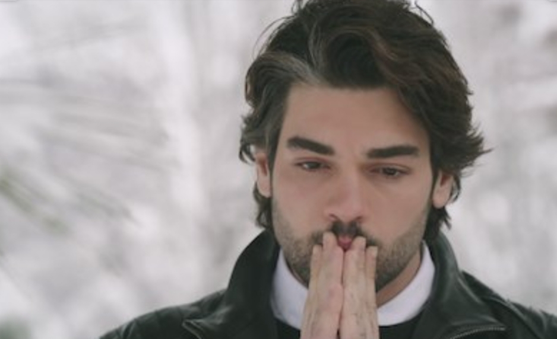

**Lulu zen-Aloush** 7 May 2020

_Winter Sun_ (2016) is a Turkish drama like no other. It's not a typical love story like the series _Kara Sevda_. Rather it explores the values of Turkey’s competing cultural factions, those of conservative traditionalists on the one side and modernisers associated with the West on the other.

The show is about Efe, adopted age 7, who is searching for his original family. Now 27, he discovers his identical twin brother, Mete, and his mother and relatives.

They are amazed: they believed he died in a car crash with his father some 20 years before.

While physically identical, the twins, both played by Şükrü Özyıldız, have become very different people, raised in very different ways.

Efe’s a fisherman and his adopted family poor, but he is loveable, caring and affectionate. Mete, a rich fashion business owner, is miserable and aggressive and private even with his closest friends and family. Mete is also having an affair with his wife Nisan’s best friend, Seda.

But the reunion does not last long.

When the local mafia find out Efe is alive after all these years, they are concerned. They were involved in the car crash that killed his father and worry that Efe will remember or dredge up the past and the dirty secrets behind the murder.

Have you guessed?

The mafia eliminate who they think is Efe, but they get the wrong man. Mete is shot and dies in front of his lost brother.

The devastated Efe vows revenge. He adopts the identity of his brother to be able to expose and bring to justice the killers.

**They kill Mete thinking he is Efe. So Efe must become Mete. Do you follow?**

Of course, it is not so simple. Not only the mafia are involved and there are secrets everywhere. _Winter Sun_ twists and turns and (almost) nobody is innocent. Watch out for Mete’s stepdad, for example.

Stepping into his brother’s shoes is not easy for Mete. Not literally: they fit. But to play Mete, Efe must be someone else. He cannot even be the son to his adopted family – he can only watch as they mourn his apparent death. And Efe must also negotiate being with Nisan, his dead brother’s wife – not made easier by her noble spirit in the face of her (now dead) husband’s repeated infidelity and deceit.

Efe has become Mete to solve a mystery, and, for now, he must stick to his role. As he begins Efe’s only help is from Kadim (Hakan Boyav) an old friend of his father’s.

He gets closer to the truth day by day, while not imagining how close those involved in his father’s death are.

In this new world Efe is living in, everyone seems to have a deceitful side; dark secrets are revealed episode after episode. Everyone will be tested and questioned, hearts will be broken but – we are sure - whoever is hiding will pay thanks to Efe.

**Available on:** Netflix

**Genre:** Drama

**Running Time:** 45 minutes an episode, 50 episodes

